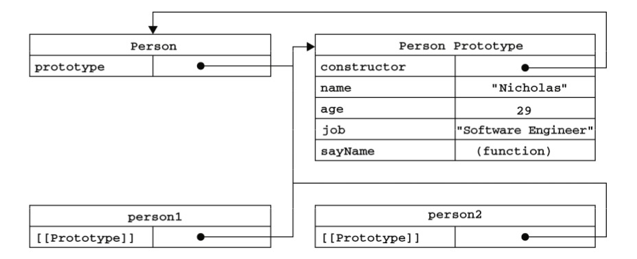
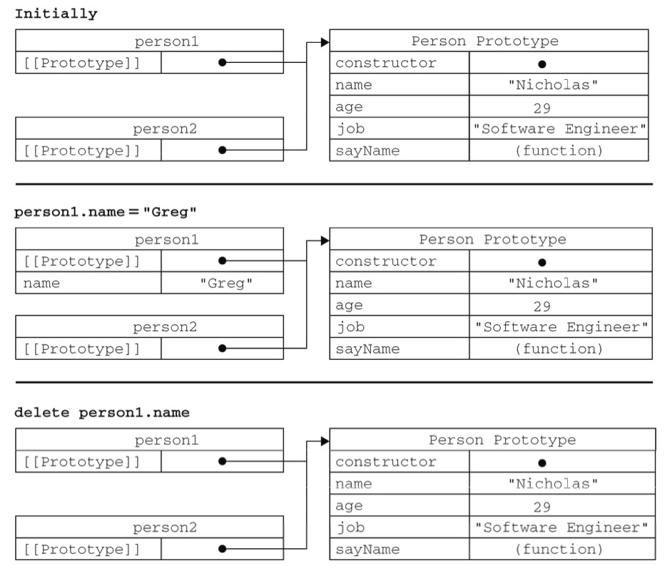
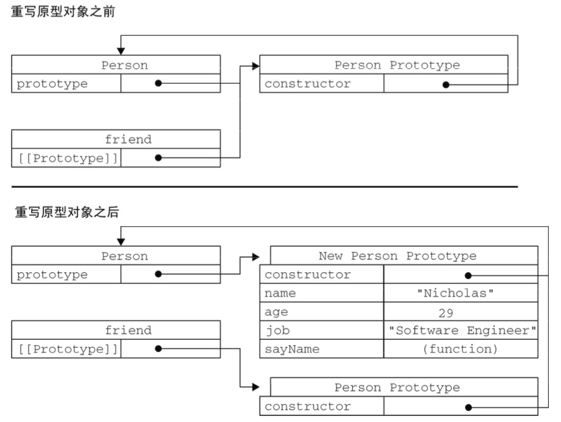

# JS中原型对象的性质

> 摘自 《JavaScript高级程序设计》

## 理解原型对象

无论什么时候，只要创建一个新函数，就会根据一组特定的规则为该函数创建一个`prototype`属性，这个属性指向函数的原型对象。在默认情况下，所有原型对象都会获得一个`constructor`（构造函数）属性，这个属性包含一个指向`prototype`属性所在函数的指针。如`Person.prototype.constructor`指向`Person`。而通过这个构造函数，还可以继续为原型对象添加其他属性和方法。

```javascript
function Person() {
}
Person.prototype.name = "Nicholas";
Person.prototype.age = 29;
Person.prototype.job = "Software Engineer";
Person.prototype.sayName = function () {
    alert(this.name);
};
const person1 = new Person();
person1.sayName();   //"Nicholas"
const person2 = new Person();
person2.sayName(); //"Nicholas"
alert(person1.sayName == person2.sayName);  //true
```

创建了自定义的构造函数之后，其原型对象默认只会取得constructor属性；至于其他方法，则都是从`Object`继承而来的。当调用构造函数创建一个新实例后，该实例的内部将包含一个指针（内部属性），指向构造函数的原型对象。ES5中管这个指针叫`[[Prototype]]`。 虽然在脚本中没有标准的方式访问`[[Prototype]]` ， 但Firefox、Safari和Chrome在每个对象上都支持一个属性 `_proto_` ;而在其他实现中，这个属性对脚本则是完全不可见的。==不过，要明确的真正重要的一点就是，这个连接存在于实例与构造函数的原型对象之间，而不是存在于实例与构造函数之间。==

​	以前面使用`Person`构造函数和`Person.prototype`创建实例的代码为例，下图展示了各个对象之间的关系。



​	上图展示了`Person`构造函数、`Person`的原型属性以及`Person`现有的两个实例之间的关系。 在此，`Person.prototype` 指向了原型对象，而 `Person.prototype.constructor `又指回了 `Person`。 原型对象中除了包含`constructor`属性之外，还包括后来添加的其他属性。`Person`的每个实例—— `person1`和`person2`都包含一个内部属性，该属性仅仅指向了`Person.prototype` ；换句话说，**它们与构造函数没有直接的关系。**此外，要格外注意的是，虽然这两个实例都不包含属性和方法，但我们却可以通过调用`person1.sayName()`。这是通过查找对象属性的过程来实现的。

​	虽然在所有实现中都无法访问到`[[Prototype]]`，但可以通过`isPrototypeOf()`方法来确定对象之 间是否存在这种关系。从本质上讲，如果`[[Prototype]]`指向调用`isPrototypeOf()`方法的对象 (`Person.prototype`)，那么这个方法就返回true，如下所示：

```javascript
Person.prototype.isPrototypeOf(person1); // true
Person.prototype.isPrototypeOf(person2); // true
```

这里，用原型对象的`isPrototypeOf()`方法测试了`person1`和`person2`。因为它们内部都有一个指向`Person.prototype`的指针，因此都返回了` true`。

在ES5中增加了一个新方法，叫`Object.getPrototypeOf()`，在所有支持的视线中，这个方法返回`[[Prototype]]`的值。如下：

```javascript
Object.getPrototypeOf(person1) == Person.prototype; // true
Object.getPrototypeOf(person1).name; // Nicholas
```

​	这里的第一行代码只是确定`Object.getPrototypeOf()`返回的对象实际就是这个对象的原型。 第二行代码取得了原型对象中`name`属性的值，也就是"Nicholas"。使用`Object.getPrototypeOf () `可以方便地取得一个对象的原型，而这在利用原型实现继承的情况下是非常重要的。 

​	每当代码读取某个对象的某个属性时，都会执行一次搜索，目标是具有给定名字的属性。搜索首先 从对象实例本身开始。如果在实例中找到了具有给定名字的属性，则返回该属性的值；如果没有找到， 则继续搜索指针指向的原型对象，在原型对象中查找具有给定名字的属性。如果在原型对象中找到了这 个属性，则返回该属性的值。也就是说，在我们调用`personl. sayName()`的时候，会先后执行两次搜索。首先，解析器会问：“实例`personl`有`sayName`属性吗？ ”答：“没有。”然后，它继续搜索，再问：“`personl`的原型有`sayName`属性吗？ ”答：“有。”于是，它就读取那个保存在原型对象中的函数。当我们调用`person.sayName()`时，将会重现相同的搜索过程，得到相同的结果。而**这正是多个对象实例共享原型所保存的属性和方法的基本原理。**

虽然可以通过对象实例访问保存在原型中的值，但却不能通过对象实例重写原型中的值。如果我们 在实例中添加了一个属性，而该属性与实例原型中的一个属性同名，那我们就在实例中创建该属性，该属性将会屏蔽原型中的那个属性。来看下面的例子。

```javascript
function Person(){
}
Person.prototype.name = "Nicholas";
Person.prototype.age = 29;
Person.prototype.job = "Software Engineer"; 
Person.prototype.sayName = function(){
    console.log(this.name);
};
let person1 = new Person();
let person2 = new Person();

person1.name = "Greg";
console.log(person1.name); // Greg --来自实例
console.log(person2.name); // Nicholas -- 来自原型
```

在这个例子中，`person1`的`name`被一个新值给屏蔽了。但无论访问`personl.name`还是访问`person2.name`都能够正常地返回值，即分别是"Greg"(来自对象实例）和"Nicholas"(来自原型)。 当在 `console.log ()`中访问` person1.name`时，需要读取它的值，因此就会在这个实例上搜索一个名为`name` 的属性。这个属性确实存在，于是就返回它的值而不必再搜索原型了。当以同样的方式访问`person2.name`时，并没有在实例上发现该属性，因此就会继续搜索原型，结果在那里找到了`name`属性。

当为对象实例添加一个属性时，这个属性就会屏蔽原型对象中保存的同名属性；换句话说，添加这个属性只会阻止我们访问原型中的那个属性，但不会修改那个属性。即使将这个属性设置为null，也只会在实例中设置这个属性，而不会恢复其指向原型的连接。不过，使用delete操作符则可以完全删 除实例属性，从而让我们能够重新访问原型中的属性，如下所示。

```javascript
function Person(){
}
Person.prototype.name = "Nicholas";
Person.prototype.age = 29;
Person.prototype.job = "Software Engineer";
Person.prototype.sayName = function(){
    console.log(this.name);
};
var person1 = new Person();
var person2 = new Person();

person1.name = "Greg";

person1.name; // Greg -- 来自实例
person2.name; // Nicholas -- 来自原型

delete person1.name;
person1.name; // Nicholas --来自原型
```

使用`delete`操作符删除了 `person1.name`,之前它保存的"Greg" 值屏蔽了同名的原型属性。把它删除以后，就恢复了对原型中`name`属性的连接。因此，接下来再调用 `person1.name`时，返回的就是原型中`name`属性的值了。

使用`hasOwnProperty()`方法可以检测一个属性是存在于实例中，还是存在于原型中。这个方法（不要忘了它是从`Object`继承来的）只在给定属性存在于对象实例中时，才会返回`true`。来看下面这个例子：

```javascript
function Person(){
}
Person.prototype.name = "Nicholas";
Person.prototype.age = 29;
Person.prototype.job = "Software Engineer";
Person.prototype.sayName = function(){
    console.log(this.name);
};
var person1 = new Person();
var person2 = new Person();

person1.hasOwnProperty("name");  //false
person1.name = "Greg";
console.log(person1.name); // Greg -- 来自实例
console.log(person1.hasOwnProperty("name")); // true

console.log(person2.name); // Nicholas --来自原型
console.log(person2.hasOwnProperty("name")); // false

delete person1.name;
console.log(person1.name); //  Nicholas --来自原型
console.log(person1.hasOwnProperty("name")); // false
```

通过使用`hasOwnProperty()`方法，可以很清楚地看到何时访问的是实力属性，何时访问的是原型属性。调用`person1.hasOwnProperty("name")`时，只有当`person1`重写`name`属性后才会返回`true`，因为只有这时`name`才是一个实例属性，而非原型对象。下图展示了上面例子不同情况下的实例与原型的关系（为简单起见，图中省略了与`Person`构造函数的关系）。



**注意：**ES5 的 `Object.getOwnPropertyDescriptor()`方法只能用于实例属 性，要取得原型属性的描述符，必须直接在原型对象上调用`Object.getOwnPropertyDescriptor()`方法。

## 原型与in操作符

有两种方式使用`in`操作符：单独使用和在`for-in`中使用。

单独使用时，`in`操作符会在通过对象能够访问给定属性时返回`true`，无论实例存在于实例中还是原型中。例子：

```javascript
function Person(){
}
Person.prototype.name = "Nicholas";
Person.prototype.age = 29;
Person.prototype.job = "Software Engineer";
Person.prototype.sayName = function(){
    console.log(this.name);
};
var person1 = new Person();
var person2 = new Person();

person1.hasOwnProperty("name");  //false
"name" in person1; // true
person1.name = "Greg";
console.log(person1.name); // Greg -- 来自实例
"name" in person1; // true
```

在以上代码中，`name`要么直接在对象上访问到，要么通过原型访问到。调用`name in person1`始终返回`true`，无论是在原型还是实例中。同事使用`hasOwnProperty()`方法和`in`操作符，就可以确定属性到底是在对象中还是在原型中。

```javascript
function hasPrototypeProperty(object, name){
        return !object.hasOwnProperty(name) && (name in object);
}
```

上面代码只要`in`操作符返回`true`，而`hasOwnProperty()`返回`false`，就可以确定属性是原型中的属性。

在使用`for-in`循环时，返回的是所有能够通过对象访问的、可枚举的属性，切中既包括存在于实例中的属性，也包括存在于原型中的属性。屏蔽了原型中不可枚举属性（即将`[[Enmuerable]]`标记为`false`的属性）的实例属性也会在`for-in `循环中返回。因为根据规定，所有开发人员定义的属性都是可枚举的。

## 更简单的原型语法

前面的例子每添加一个属性和方法就要敲一遍`Person.prototype`。为减少不必要输入，也为了从视觉上更好地封装原型的功能，更常见的做法是用一个包含属性和方法的对象字面量来重写整个原型对象，如下：

```javascript
function Person(){
}
Person.prototype = {
    name: "Nicholas",
    age: 29,
    job:  "Software Engineer";
	sayName = function(){
    	console.log(this.name);
	}
};
```

在上面的代码中，我们将`Person.prototype`设置为等于一个以对象字面量形式创建的新对象。 最终结果相同，但有一个例外：`constructor`属性不再指向`Person`了。前面曾经介绍过，==每创建一个函数，就会同时创建它的`prototype`对象，这个对象也会自动获得`constructor`属性。==而我们在这里使用的语法，==本质上完全重写了默认的`prototype`对象==，因此constructor属性也就变成了新对象的`constructor`属性（指向Object构造函数），不再指向`Person`函数。此时，尽管instanceof 操作符还能返回正确的结果，但通过constructor已经无法确定对象的类型了，如下所示。

```javascript
var friend = new Person();
console.log(friend instanceof Object); // true
console.log(friend instanceof Person); // true
console.log(friend.constructor == Person); // false
console.log(friend.constructor == Object); // true
```

在此，用`instanceof`操作符测试`Object`和`Person`仍然返回`true`，但`constructor`属性则等于`Object`而不等于`Person` 了。如果`constructor`的值真的很重要，可以像下面这样特意将它设 置回适当的值。

```javascript
function Person(){
}
Person.prototype = {
    name: "Nicholas",
    age: 29,
    job:  "Software Engineer";
	sayName = function(){
    	console.log(this.name);
	}
};
```

以上代码特意包含了一个`constructor`属性，并将它设置为`Person`，从而确保了通过该属性能够访问到适当的值。

注意，以这种方式重设`constructor`属性，会导致它的`[[Enmuerable]]`特性被设置为`true`。默认情况下，原生的`constructor`属性是不可枚举的。

因此，如果是ES5可以试试，`Object.defineProperty()`。

```javascript
Object.defineProperty(Person.prototype, "constructor", {
        enumerable: false,
        value: Person
});
```

注：ES5其实可以使用`Object.create()`方法：该[方法](https://developer.mozilla.org/zh-CN/docs/Web/JavaScript/Reference/Global_Objects/Object/create)创建一个新对象，使用现有的对象来提供新创建的对象的`__proto__`。ES5之前实现继承时常用的方法。

## 原型的动态性

由于原型中查找值的过程是一次搜索，因此对原型对象所做的任何修改都能够立即从实例上反映出来——即使是先创建了实例后修改原型也照样如此。

```javascript
var friend = new Person();
Person.prototype.sayHi = function(){
    console.log("hi");
};
friend.sayHi(); // "hi"
```

以上代码先创建了`Person`的一个实例，并将其保存在`person`中。然后，下一条语句在`Person.prototype`中添加了一个方法`sayHi()`。即使`person`实例是在添加新方法之前创建的，但它仍然可 以访问这个新方法。其原因可以归结为实例与原型之间的松散连接关系。当我们调用`person. sayHi() `时，首先会在实例中搜索名为`sayHi`的属性，在没找到的情况下，会继续搜索原型。因为实例与原型之间的连接只不过是一个指针，而非一个副本，因此就可以在原型中找到新的`sayHi`属性并返回保存在那里的函数。

 尽管可以随时为原型添加属性和方法，并且修改能够立即在所有对象实例中反映出来，但如果是重写整个原型对象，那么情况就不一样了。我们知道，调用构造函数时会为实例添加一个指向最初原型的`[[Prototype]]`指针，而把原型修改为另外一个对象就等于切断了构造函数与最初原型之间的联系。 请记住：==实例中的指针仅指向原型，而不指向构造函数。==看下面的例子。

```javascript
function Person(){
}
var friend = new Person();
Person.prototype = {
    constructor: Person,
    name : "Nicholas",
    age : 29,
    job : "Software Engineer",
    sayName : function () {
        alert(this.name);
    }
};
friend.sayName();   //error
```

在这个例子中，我们先创建了`Person`的一个实例，然后又重写了其原型对象。然后在调用`friend.sayName()`时发生了错误，因为`friend`指向的原型中不包含以该名字命名的属性。过程的内幕如下图：



重写原型对象切断了现有原型与任何之前已经存在的对象实例之间的联系；它们引用的仍然是最初的原型。

## 原生对象的原型

原型模式的重要性不仅体现在创建自定义类型方面，就连所有原生的引用类型，都是采用这种模式创建的。所有原生引用类型（`Object`、`Array`、`String`等）都在其构造函数的原型上定义了方法。

例如在`Array.prototype`中可以找到`sort()`方法，而在`String.prototype`中可以找到`substring()`方法，如下：

```javascript
typeof Array.prototype.sort // function
typeof String.prototype.substring // function
```

通过原生对象的原型，不仅可以取得所有默认方法的引用，而且可以定义新方法。可以像修改自定义对象的原型一样修改原生对象的原型，因此可以随时添加方法。

尽管可以这样做，但是不推荐在产品化的程序中修改原生对象的原型。

## 原型对象的问题

原型模式也不是没有缺点。首先，它省略了为构造函数传递初始化参数这一环节，结果所有实例在默认情况下都将取得相同的属性值。虽然这会在某种程度上带来一些不方便，但还不是原型的最大问题。 原型模式的最大问题是由其共享的本性所导致的。 

原型中所有属性是被很多实例共享的，这种共享对于函数非常合适。对于那些包含基本值的属性倒 也说得过去，毕竟（如前面的例子所示），通过在实例上添加一个同名属性，可以隐藏原型中的对应属 性。然而，对于包含引用类型值的属性来说，问题就比较突出了。来看下面的例子。

```javascript
function Person(){
}
Person.prototype = {
    constructor: Person,
    name : "Nicholas",
    age : 29,
    job : "Software Engineer",
    friends : ["Shelby", "Court"],
    sayName : function () {
        alert(this.name);
} };
var person1 = new Person();
var person2 = new Person();
person1.friends.push("Van");
alert(person1.friends);    //"Shelby,Court,Van"
alert(person2.friends);    //"Shelby,Court,Van"
alert(person1.friends === person2.friends);  //true
```

在此，`Person.prototype`对象有一个名为`friends`的属性，该属性包含一个字符串数组。然后， 创建了`Person`的两个实例。接着，修改了`person1.friends`引用的数组，向数组中添加了一个字符 串。由于`friends`数组存在于`Person.prototype`而非`person1`中，所以刚刚提到的修改也会通过 `person2. friends` (与`personl.friends`指向同一个数组）反映出来。假如我们的初衷就是像这样 在所有实例中共享一个数组，那么对这个结果我没有话可说。可是，实例一般都是要有属于自己的全部属性的。而这个问题正是我们很少看到有人单独使用原型模式的原因所在。