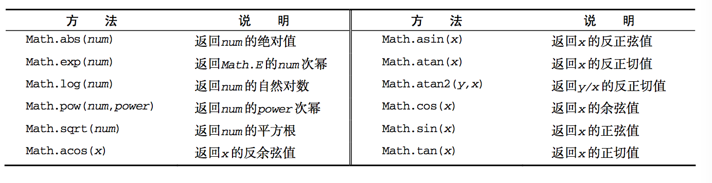

## 基本概念

1. JS区分大小写；函数名不能适用`typeof`，它是一个关键字。

2. 标识符就是指变量、函数、属性的名字，或者函数的参数。

3. JS注释

   ```javascript
   // 单行注释
   /**
   * 这是多行注释
   * (块级)注释
   */
   ```

4. 严格模式：为`JavaScript`定义了一种不同的解析与执行模式。是ES5引入的一个概念，处理了ES3的一些不确定行为。整个脚本中使用或函数内部使用，分别加如下代码：

   ```javascript
   // 整个脚本中，在顶部加
   "use strict"
   // 函数内部
   function doSomething() {
       "use strict"
       // 函数体
   }
   ```

5. JS语句以分号结尾，如果分号省略，则由解析器确定语句的结尾；建议任何时候都不要省略分号。

6. JS变量类型是松散类型的，即可以用来保存任何类型的数据，每个变量仅仅是一个用于保存值的占位符而已。

7. JS有5种基本数据类型：`Undefined`、`Null`、`Boolean`、`Number`和`String`;还有一种复杂的数据类型`Object`，它本质上是由一组无序的名值对组成的。

8. `typeof`是操作符，而不是函数。它用来检测给定变量的数据类型。`typeof`可能返回的字符串：

   - "undefined"：如果这个值未定义；
   - "boolean"：如果这个值是布尔值；
   - "string"：如果这个值是字符串；
   - "number"：如果这个值是数值；
   - "object"：如果这个值是对象或`null`；`null`会被认为是一个空的对象引用
   - "function"：如果这个值是函数。

9. `Undefined`类型只有一个值，即`undefined`。它是在第三版引入为了区分空对象指针与未经初始化的变量。初始声明的未赋值或赋值`undefined`的变量是`undefined`;但与尚未定义的变量是不同的。

   ```javascript
   let message;
   // 下面变量未声明
   // let age;
   alert(message); // “undefined”
   alert(age);     // 产生错误
   
   alert(typeof message)； // “undefined”
   alert(typeof age)；     // “undefined”
   ```

   然而，对未初始的变量执行`typeof`操作符会返回`undefined`值，对未声明的变量进行此操作结果也是`undefined`。

10. `Null`类型也只有一个值，即`null`。从逻辑角度看，`null`表示一个空对象指针，这也正式为什么使用`typeof`操作符监测null值会返回"object"的原因。**如果定义的变量用于保存对象，那么最好将该变量初始化为null而不是其他值。**这样一来直接检查`null`值就可以知道相应的变量是否已保存了一个对象的引用。也就是，只要意在保存对象的变量还没有真正保存对象，就应该明确地让该变量保存为`null`。这样做不仅体现`null`作为空对象指针的管理，而且有利于进一步区分`null`和`undefined`。

11. `Boolean`类型有两个字面值:`true`和`false`。可以对任何数据类型的值调用`Boolean()`函数，而且总会返回一个`Boolean`值，该值被保存在`messageAsBoolean`变量中。

12. `Number`类型使用了`IEEE754`格式来表示整数和浮点数。JS能够标识的最大数值保存在`Number.MIN_VALUE`中，值是`5e-324`；能够标识最大的值保存在`Number.MAX_VALUE`中，值是`1.7976931348623157e+308`。超出此范围的值会被转换为`Infinity`和`-Infinity`。可以使用`isFinite()`函数，函数在参数位于最小与最大数值之间时会返回`true`。

13. `NaN`是一个特殊的数值，即非数值（Not a Number），这个数值用于标识一个本来要返回数值的操作数未返回数值的情况。`isNaN()`函数可以确定参数是否“不是数值”。`NaN`有两个特点：

    - 任何涉及`NaN`的操作都会返回`NaN`；
    - `NaN`与任何值都不相等，包括`NaN`本身。

14. 数值转换，有3个函数可以把非数值转换为数值：`Number()`、`parseInt()`、`parseFloat()`。

15. `String`类型用于表示由零或多个16位`Unicode`字符组成的字符序列，即字符串。`String`类型包含一些特殊的字符字面量，也叫转义序列，用于表示非打印字符或有其他用途的字符：`\n \t \b \r \f \\ \' \"`。

16. 字符串是不可变的，字符串一旦创建，他们的值就不能改变。要改变某个变量保存的字符串，首先要销毁原来的字符串，然后再用另一个包含新值的字符串填充该变量。

17. 转换为字符串的方法，几乎每个值都有`toString()`方法，包括：数值、布尔值、对象、字符串。但`null`和`undefined`值没有这个方法。默认情况下，该方法以十进制返回字符串，同事支持二进制、八进制、十六进制，乃至其他任意有效进制格式表示的字符串值。

    ```javascript
    var num = 10;
    alert(num.toString());    // "10"
    alert(num.toString(2));   // "1010"
    alert(num.toString(8));   // "12"
    alert(num.toString(10));  // "10"
    alert(num.toString(16));  // "a"
    ```

    另一个方法是`String()`，这个函数能转换任何类型的值为字符串。遵循的转换规则：

    - 如果值有`toString()`方法，则调用该方法并返回相应结果；
    - 如果是`null`，则返回"null"；
    - 如果是`undefined`，则返回"undefined"。

18. `Object`类型是一组数据和功能的集合。它是所有它的实例的基础，即`Object`类型所具有的任何属性和方法也同样存在于更具体的对象中。每个实例都具有下列的属性和方法：

    - `constructor`：构造函数，保存着创建当前对象的函数；
    - `hasOwnProperty(propertyName)`：用于检查给定的属性在当前对象实例中（而不是在实例的原型中）是否存在；
    - `isPrototypeOf(object)`：检查传入的对象是否是传入对象的原型；
    - `propertyIsEnumerable(propertyName) `：检查给定的属性是否能够用`for-in`语句来枚举。
    - `toLocalString()`：返回对象的字符串表示，该字符串与执行环境的地区对应；
    - `toString()`：返回对象的字符串表示；
    - `valueOf()`：返回对象的字符串、数值或布尔值表示。通常与`toString()`方法的返回值相同。

19. 操作符用于操作数值：包括算数操作符、位操作符、关系操作符、相等操作符。

    - 一元操作符：递增`++`、递减`—`、加`+`、减`-`；

    - 位操作符：JS中的所有数值都是以IEEE-754 64位格式存储，但位操作符并不直接操作64位的值，而是先将64位的值转换成32位的整数，然后执行操作，最后再将结果转换回64位。对于有符整数，第32位表示符号，0 表示整数，1表示负数。负数使用的是二进制补码。

      1. 按位非`~`：返回数值的反码；
      2. 按位与`&`：对应位都是1返回1，任何一位是0，结果返回0；
      3. 按位或`|`：有一个位是1就返回1，只有两个位是0才返回0；
      4. 按未异或`^`：只有一个1时才返回1，两个位都是1或都是0，返回0；
      5. 左移`<<`：将数值的所有位向左移动指定的位数；
      6. 有符右移`>>`：将数值向右移动，但保留符号位；在右移过程中会出现空位，空位在原数值的左侧、符号位右侧，此时会用**符号位的值**来填充所有空位；
      7. 无符号右移`>>>`：将数值的所有32位向右移动；对正数来说，结果与有符右移相同。对于负数，无符号右移以0来填充空位，而不是像有符号右移以符号位的值来填充空位。无符右移操作符会把负数的二进制码当成正数的二进制码。而且，由于负数以其绝对值的二进制码补码形式存在，因此就会导致无符号右移后的结果非常之大。如：`-64`的二进制码为`11111111111111111111111111000000 `，无符右移之后会把二进制码当成正数的二进制码，换算成十进制就是`4294967232 `，右移5位之后就成了`00000111111111111111111111111110 `即十进制`134217726`。

    - 布尔操作符：布尔操作符一共有3个：与`&&`、或`||`、非`!`；

    - 乘性操作符：乘法、除法、求模；

    - 加性操作符：加法、减法；

    - 关系操作符：小于、大于、小于等于、大于等于；

    - 相等操作符：相等`==`和不相等`!=`，先转换再比较；全等`===`和不全等`!==`，仅比较不转换，推荐使用。

      - 相等和不相等：先强制转型，再比较相等性
      - 全等和不全等：两个操作数未经转换就相等的情况下返回`true`

    - 条件操作符：`variable = boolean_expression ? true_value : false_value;`

    - 赋值操作符：把右侧的值赋值给左侧的变量。下面是简化的复合赋值操作符，这些操作符的主要目的是简化赋值操作，不会带来任何性能的提升。

      ```javascript
      = *= /= %= += -= <<= >>= >>>=
      ```

    - 逗号操作符：可以在一条语句中执行多个操作，如

      ```javascript
      let a = 1, b = 2, c = 3;
      ```

20. `label`语句，使用label语句可以再代码中添加标签，以便将来使用：`label: statement`。例子：定义start标签，可以再将来由break或continue语句引用。加标签的语句一般都要与for语句等循环语句进行配合使用。

    ```javascript
    start: for(let i=0; i < count; i++){
        console.log(i);
    }
    ```

21.  函数参数：JS函数的参数不介意传进来多少个参数，也不在乎传进来参数是什么数据类型。也就是说，即便你定义的函数只接收两个参数，在调用这个函数时也未必一定要传递两个参数。可以传递一个或三个，解析器都可以解析。因为JS中的参数在内部是用一个数组来表示的。函数接收到的始终都是这个数组，而不关心数组中包含哪些参数。在函数体内可以通过`arguments`对象来访问这个参数数组，从而获取传递函数的每个参数。没有传递值的命令参数将自动被赋予`undefined`值，这就跟定义了变量但又没有初始化一样。

22. 函数没有重载：在其他语言中，可以为一个函数编写两个定义，只要两个定义的签名（接受的参数的类型和数量）不同即可。JS函数没有签名，因为参数是由包含零或多个值的数组来表示的。如果函数名字相同，之后定义的函数会覆盖先定义的函数。

    ```javascript
    function addSomeNumber(num){
        return num + 100;
    }
    function addSomeNumber(num) {
        return num + 200;
    }
    const result = addSomeNumber(100); //300
    ```

    

## 变量

1. 定义基本类型值和引用类型值的方式是类似的：创建一个变量并为该变量赋值。但是对不同类型值进行操作是不一样的，对于引用类型我们可以为其添加属性和方法，也可以改变和删除其属性和方法。但是我们不能给基本类型添加属性或方法，尽管这样做不会导致错误。

2. 复制变量值：如果从一个变量向另一个变量复制基本类型的值，会在变量对象上创建一个新值，然后把该值复制到为新变量分配的位置上。当一个变量向另一个变量复制引用类型的值时，同样也会将存储在变量对象中的值复制一份放到为新变量分配的空间中。不同的是，这个值的副本实际上是一个指针，而这个指针指向存储在堆中的一个对象。复制操作结束后，两个变量实际上将引用同一个对象。因此，改变其中一个变量，就会影响另一个变量。

3. 传递参数：JS所有函数的参数都是按值传递的。也就是说，把函数外部的值复制给函数内部的参数，就和把值从一个变量复制到另一个变量一样。在向参数传递基本类型值的值时，被传递的值会被复制给一个局部变量。在向参数传递引用类型时，会把这个值在内存中的地址复制给一个局部变量，因此这个局部变量的变化会反映在函数的外部。

4. 检测类型：`typeof`在检测基本数据类型时很有用，但在检测引用类型的值时，它的用处不大。通常，我们并不想知道某个值是对象，而是想知道它是什么类型的对象。JS提供了`instanceof`操作符，语法如下：

   ```javascript
   result = variable instanceof constructor
   ```

   如果变量是给定引用类型的实例，那么`instanceof`操作符就会返回`true`。根据规定，所有引用类型的值都是`Object`的实例。因此在检测一个引用类型值和`Object`构造函数时，`instanceof`操作符始终会返回`true`。检测基本类型的值，会返回`false`，因为基本类型不是对象。

   ```javascript
   // 变量person是Object吗
   alert(person instanceof Object); 
   // 变量colors是Array吗
   alert(colors instanceof Array); 
   alert(patterninstanceofRegExp); 
   ```

## 引用类型

1. 引用类型的值（对象）是引用类型的一个实例。在JavaScript中引用类型是一种数据结构，用于将数据和功能组织在一起。它也常被称为类，但这种称呼并不妥当。

2. 创建Object实例的方式有两种。一种是使用`new Object()`；另一种是使用对象字面量表示法。

   ```javascript
   const person = new Object();
   person.name = "Nicholas";
   person.age = 29;
   
   const person = {
       name : "Nicholas",
       age : 29
   }; 
   ```

   在使用对象字面量语法时，属性名也可以使用字符串，但这里的数值属性名会自动转换为字符串：

   ```javascript
   const person = {
            "name" : "Nicholas",
            "age" : 29,
            5 : true
   };
   ```

   访问对象属性时可以使用点表示法或方括号表示法。方括号表示法的有点事可以通过变量来访问属性。

3. JS数组的每一项可以用来保存任何类型的数据。数组的大小可以动态调整，即可以随着数据的添加自动增长以容纳新增数据。`Array.isArray()`可以用来检测数据是不是数组。

4. 所有对象都具有`toLocalString()`、`toString()`、`valueOf()`方法。`toString()`方法会返回由数组中每个值的字符串形式拼接而成的一个以逗号分隔的字符串。

5. Array的方法:

   * `push()`：在数组末端添加任意个项，并返回新数组的长度
   * `pop()`：移除数组中的最后一项，并返回此值
   * `shift()`：移除数组中的第一个项，并返回此值
   * `unshift()`：在数组前端添加任意个项，并返回新数组的长度
   * `reverse()`：数组倒序排列，返回排序后的数组
   * `sort()`：按升序排列数组项；或者接收一个函数，进行定制排序设计；返回排序后的数组
   * `concat()`：合并两个或多个数组，并返回新数组
   * `slice()`：
   * `splice`：主要用途是向数组中部插入项，有三种使用方法：
     1. 删除：可以删除任意数量的项，只需指定2个参数，要删除的第一项的位置和要删除的项数。如：splice(0,2)会删除数组中的前两项。
     2. 插入：可以向指定位置插入任意数量的项，主需要提供3个参数：起始位置、0（要删除的项数）和要插入的项。如果插入多个项，可以再传入第四、第五，以至任意多个项。如：splice(2,0,"red", "green")会从当前数组的位置2开始插入字符串"red"和"green"。
     3. 替换：可以向指定位置插入任意数量的项，且同时删除任意数量的项，只需要指定3个参数：起始位置、要删除的项数和要插入的任意数量的项。如：splice(2,1,"red","green")会删除当前数组位置2的项，然后再从位置2开始插入字符串"red"和"green"。
   * `indexOf()`和`lastIndexOf`：这两个方法都接收两个参数：要查找的项和（可选的）表示查找起点位置的索引。分别是：从数组的开头开始向后查找；从数组末尾开始向前查找；都返回查找的项在数组中的位置，或者在没有找到的情况下返回-1。
   * 迭代方法`every()`：对数组中每一项运行给定函数，如果该函数对每一项都返回`true`,则返回`true`
   * `filter`：对数组中每一项运行给定函数，返回该函数会返回`true`的项组成的数组。
   * `forEach()`：对数组中每一项运行给定函数。无返回值。
   * `map()`：对数组中每一项运行给定函数，返回每次调用的结构组成的数组。
   * `some()`：对数组中每一项运行给定函数，如果该函数对任一项返回`true`，则返回`true`。
   * 归并方法`reduce()`和`reduceRight()`：两个方法都会迭代数组的所有项，然后构建一个最终返回的值。其中，`reduce()`方法从数组的第一项开始，逐个遍历到最后。而`reduceRigth()`从数组追后一项开始，向前遍历到第一项。都接受两个参数：一个在每一项上调用的函数和（可选的）作为归并基础的初始值。函数接受四个参数：前一个值、当前值、项的索引和数组对象。这个函数返回的任何值都会作为第一个参数自动传给下一项。

6. JS中的`Date`类型使用自`UTC`时间。`Date`类型重写了`toLocalString()`、`toString()`和`valueOf()`方法。`valueOf（）`方法直接返回日期的毫秒表示。

7. 常用的日期方法：

   * `getTime()`：返回日期的毫秒数
   * `getFullYear()`：取得4位数的年份
   * `getMonth()`：返回日期中的月份，从0开始，0表示1月
   * `getDate()`：返回日期月份中的天数（1到31）
   * `getDay()`：返回星期中的星期几，从0开始
   * `getHours()`：返回日期中的小时数
   * `getMinutes()`：返回日期中的分钟数(0到59)
   * `getSeconds()`：返回日期中的秒数，超过59会增加分钟数

8. RegExp类型

9. 在JS中函数实际上是对象。`Function`函数的方式是使用构造函数，可以接收任意数量的参数，但最后一个参数始终都被看成函数体，而前面的参数则枚举出了新函数的参数。下面的例子：

   ```javascript
   let sum = new Function("num1", "num2", "return num1 + num2");
   ```

   从技术角度讲，这是一个函数表达式。但是，不推荐使用这种方法定义函数，因为这种语法导致解析两次代码（第一次是解析床柜JS代码，第二次是解析传入构造函数中的字符串），产品那个人影响性能。但是这种语法可以让人很直观地理解“函数是对象，函数名是指针”的概念。

10. 由于函数名仅仅是指向函数的指针，因此函数名与包含对象指针的其他变量没有什么不同，即一个函数可能有多个名字。使用不带括号的函数名是访问函数指针，而非调用函数。

    ```javascript
    function sum(num1, num2){
        return num1 + num2;
    }
    alert(sum(10,10));        //20
    var anotherSum = sum;
    alert(anotherSum(10,10)); //20
    sum = null;
    alert(anotherSum(10,10)); //20
    ```

    此时，`anotherSum`和`sum`就指向了同一个函数，调用`snotherSum()`也可以被调用并返回结果。

11. 深入理解函数没有重载：将函数名想象为指针，上面提到的函数名相同后面的会覆盖前面的。而利用指针概念：

    ```javascript
    let addSomeNumber = function (num){
        return num + 100;
    };
    addSomeNumber = function (num) {
        6 return num + 200;
    };
    const result = addSomeNumber(100); //300
    ```

    重写代码后，创建的第二个函数实际上覆盖了引用第一个函数的变量`addSomeNumber`。

12. 函数声明与函数表达式：解析器在执行环境中加载数据时，对函数声明，解析器会率先读取，并使其在执行任何代码之前可用；置于函数表达式，则必须等到解析器执行到它所在的代码行，才会真正被解析执行。

13. 因为JS的函数名本身就是变量，所以函数也可以作为值来使用。不仅可以当做参数，也可以当做值来返回。

14. 函数内部有两个特殊的对象：`arguments`和`this`。`arguments.caller`该属性是一个指针，指向保存着调用当前函数的函数的引用；`arguments.callee`也是一个指针，指向拥有这个`arguments`对象的函数。

15. 每个函数都包含两个属性：`length`和`prototype`。`length`表示函数接收的命名参数的个数。`prototype`属性是不可枚举的。

16. 每个函数包含三个非继承而来的方法：`apply()`和`call()`。作用：在特定的作用域中调用函数，实际上等于设置函数体内`this`对象的值。`bind()`：会创建一个函数的实例，其`this`值会被绑定到传给`bind()`函数的值。

17. 为了便于操作基本类型值，JS还提供了3个特殊的引用类型：`Boolean`、`Number`和`String`。每当读取一个基本类型值的时候，后台就会创建一个对应的基本包装类型的对象，从而让我们能够调用一些方法来操作这些数据。

    1. 创建String类型的一个实例；
    2. 在实例上调用指定的方法；
    3. 销毁这个实例

    可以把这三个步骤想象成执行以下代码：

    ```javascript
    let s1 = "some text";
    let s2 = s1.substring(2);
    s1 = null;
    ```

18. 引用类型和基本包装类型的主要区别是对象的生存期。使用`new`操作符创建的引用类型的实例，在执行流离开当前作用于之前都一直保存在内存中。自动创建的基本包装类型对象，则只存在于一行代码的执行瞬间，然后立即被销毁。这意味着我们不能在运行时为基本类型值添加属性和方法。

    ```javascript
    var s1 = "some text";
    s1.color = "red";
    alert(s1.color);   //undefined
    ```

    第二行创建的String对象在执行第三行代码时已经被销毁了；第三行又创建了自己的String对象，而该对象没有`color`属性。

19. `Number`是与数字值对应的引用类型。Number类型重写了`valueOf()`、`toLocaleString()`和`toString()`方法，重写后`valueOf()`返回对象表示的基本类型的数值，另外两个函数则返回字符串形式的数值。`toString()`将数值转为字符串，默认是10进制；`toFixed()`方法会按照指定的小数位返回数值的字符串表示。

    ```javascript
    let num1 = 10;
    console.log(num1.toFixed(2)); // "10.00"
    
    let num2 = 10.005;
    console.log(num.toFixed(2)); // "10.01"
    ```

20. `String`类型是字符串的对象包装类型。这个类型中有很多方法帮助字符串进行解析和操作：

    * 字符方法`charAt()`和`charCodeAt()`：接收一个基于0的字符位置。第一个函数返回给定位置的那个字符。第二个函数返回给定位置的那个字符的字符编码。

    * 字符串操作方法：`concat()`:将一个或多个字符串拼接起来。可以用加号操作符或字符串模板代替。`slice`、 `substr()`和`substring()`这三个方法都会返回被操作字符串的一个子字符串，而且也接收一个或两个参数。第一个参数指定字符串的开始位置，第二个参数表示子字符串到哪里结束。具体来说，`slice()`和`substring()`的第二个参数指定的是子字符串最后一个字符后面的位置。而`substr()`的第二个参数指定的则是返回的字符个数。这些函数都是不会修改字符串本身的值，只是返回一个基本类型的字符串值。在给这些方法传递负数的情况下，`slice()`会将传入的负值与字符串的长度相加，`substr()`方法将负的第一个参数加上字符串长度，而将负的第二个参数转换为0，`substring()`会把所有的负数参数都转为0。

    * 字符串位置方法`indexOf()`和`lastIndexOf()`：从一个字符串中搜索给定的子字符串，然后返会子字符串的位置，没找到则返回-1。区别是：前者是从字符串开头向后搜索子字符串，而后者是从字符串的末尾向前搜索子字符串。都有第二个参数，表示从字符串的哪个位置开始搜索。

    * `trim()`：创建一个字符串副本，删除前置及后缀的所有空格，然后返回结果。

    * 字符串大小写转换方法：`toLowercase()`、`toUpperCase()`。

    * 字符串模糊匹配方法`match()`、`search()`、`replace()`

    * `localeCompare()`：比较两个字符串，字符串比参数字符串在字母表之前返回-1,相同返回0，之后返回1。

      ```javascript
      var stringValue = "yellow"; alert(stringValue.localeCompare("brick")); //1 
      alert(stringValue.localeCompare("yellow")); //0 
      alert(stringValue.localeCompare("zoo")); //-1
      ```

    * `fromCharCode()`：接收一或多个字符编码，然后将它们转换成一个字符串。

      ```javascript
      String.fromCharCode(104, 101, 108, 108, 111); // "hello"
      ```

21. 内置对象的定义是：由JS实现提供的、不依赖于宿主环境的对象，这些对象在JS程序执行之前就已经存在了。即在使用时开发人员不必显示地实例化内置对象，因为它们已经实例化了。内置对象：`Object`、`Array`、`String`。JS还定义了两个单体内置对象`Global`、`Math`。

22. `Global`对象是一个很特别的对象，不管从什么角度看，这个对象都是不存在的。JS中的`Global`对象：不属于任何其他对象的属性和方法，最终都是它的属性和方法。事实上没有全局变量或全局函数；所有在全局作用域中定义的属性和函数，都是`Global`对象的属性。诸如`isNan()`、`isFinite()`、`parseInt()`以及`parseFloat()`实际上全都是`Global`对象的方法。

23. `Global`对象的其他方法：`encodeURI()`、`encodeURIComopnent()`可以对URI（Uniform Resource Identifiers，通用资源标识符）进行编码，它们用特殊的UTF-8编码替换所有无效的字符，从而让浏览器能够接受和理解。

    * `encodeURI()`主要用于整个URI，`encodeURIComopnent()`用于对URI的某一段进行编码。区别在于`encodeURI()`不会对本身属于URI的特殊字符进行编码，例如冒号、正斜杠、问号和井字号；而`encodeURIComponent()`则会对它发现的任何非标准字符进行编码。第二个使用更多，因为实践中更常见的是对查询字符串参数而不是基础URI进行编码。

      ```javascript
      let uri = "http://www.wrox.com/illegal value.htm#start";
      //"http://www.wrox.com/illegal%20value.htm#start"
      console.log(encodeURI(uri));
      //"http%3A%2F%2Fwww.wrox.com%2Fillegal%20value.htm%23start"
      console.log(encodeURIComponent(uri));
      ```

    * `decodeURI()`、`decodeURIComponent()`，第一个只对`encodeURI()`替换的字符进行编码。第二个可以解码任何特殊字符的编码。

      ```javascript
      let uri = "http%3A%2F%2Fwww.wrox.com%2Fillegal%20value.htm%23start";
          //http%3A%2F%2Fwww.wrox.com%2Fillegal value.htm%23start
      console.log(decodeURI(uri));
      //http://www.wrox.com/illegal value.htm#start
      console.log(decodeURIComponent(uri));
      ```

    * `eval()`：将传入的参数当做实际的JS语句来解析，然后把执行结果插入到原位置。

    * `Global`对象的属性：

      

24. Math对象的属性：大都是数学计算中可能用到的一些特殊值。

25. Math对象的方法：

    * `min()`、`max()`确定一组数之中的最小值和最大值。

    * 舍入方法：`ceil()`：向上舍入；`floor()`向下舍入；`round()`：四舍五入

    * `random()`：返回大于等于0小于1的一个随机数

    * 其他方法：

      

## 面向对象的程序设计

1. `ECMA-262`把对象定义为：无序属性的集合，其属性可以包含基本值、对象或者函数，即对象是一组没有特定顺序的值。

2. 数据属性和访问器属性：数据属性包含一个数据值的位置；访问器属性包含一对`getter()`和`setter()`函数，不过这两个函数都不是必须的。

3. 创建对象的几种模式：

4. 工厂模式：

   ```javascript
   function createPerson(name, age, job) {
       var o = new Object();
       o.name = name;
       o.age = age;
       o.job = job;
       o.sayName = function () {
           alert(this.name);
       };
       return o;
   }
   let person1 = createPerson("Nicholas", 29, "Software Engineer");
   let person2 = createPerson("Greg", 27, "Doctor");
   ```

   函数`createPerson()`能根据接受的参数来构建一个包含所有必要信息的`Person`对象。此模式虽然解决了创建多个相似对象的问题，但没有解决对象的识别问题即怎样知道一个对象的类型。

5. 构造函数模式：JS的构造函数可用来创建特定类型的对象，如Object和Array这样的原生构造函数。也可以创建自定义构造函数，从而定义自定义对象类型的属性和方法。

   ```javascript
   function Person(name, age, job) {
       this.name = name;
       this.age = age;
       this.job = job;
       this.sayName = function () {
           alert(this.name);
       };
   }
   let person1 = new Person("Nicholas", 29, "Software Engineer");
   let person2 = new Person("Greg", 27, "Doctor");
   ```

   与工厂模式不同的是：没有显示地创建对象；直接将属性和方法赋给了`this`对象；没有`return`语句；函数名`Person`使用的是大写字母P，主要为了区别JS中的其他函数；因为构造函数本身也是函数，只不过可以用来创建对象而已。

   这种方式调用构造函数会经过以下4个步骤：

   1. 创建一个新对象
   2. 将构造函数的作用域赋给新对象，因此this就指向了这个新对象；
   3. 执行构造函数中的代码，为这个对象添加属性；
   4. 返回新对象。

   这两个对象都有`constructor`属性，该属性指向`Person`。

   ```javascript
   console.log(person1.constructor == Person); // true
   
   console.log(person2.constructor == Person); // true
   ```

   构造函数和普通函数没区别，通过new操作符调用就可以作为构造函数，不通过new调用，就是普通函数。

   使用构造函数的主要问题是每个方法都要在每个实例上重新创建一遍。前面的`person1`、`person2`都有一个名为`sayName()`的方法，但这两个方法不是同一个`Function`的实例。因为JS中函数是对象，所以每定义一个函数，也就实例化了一个对象。从逻辑上讲，此时的构造函数也可以这样定义：

   ```javascript
   function Person(name, age, job) {
       this.name = name;
       this.age = age;
       this.job = job;
       this.sayName = new Function("alert(this.name)");                
   }
   ```

   这样看，更容易看明白，每个`Person`实例都包含一个不同的`Function`实例。也就是以这种方式创建函数，会导致不同的作用域链和标识符解析，但创建`Function`新实例的机制仍然相同。因此不同实例上的同名函数是不相等的。创建两个完成同样任务的`Function`实例没有必要，且有`this`对象在，不用再代码执行前就把函数绑定到特定对象上面。可以把函数定义转移到构造函数外部来解决这个问题。

   ```javascript
   function Person(name, age, job) {
       this.name = name;
       this.age = age;
       this.job = job;
       this.sayName = sayName;
   }
   function sayName() {
       alert(this.name);
   }
   var person1 = new Person("Nicholas", 29, "Software Engineer");
   var person2 = new Person("Greg", 27, "Doctor");
   ```

   这样确实解决了这个问题，但是新的问题出现了。在全局作用域中定义的函数只能被某个对象调用，而且如果对象需要定义许多方法，那么就要定义很多个全局函数，那么我们自定义的引用类型就没有封装性可言了。

6. 原型模式：创建的每个函数都有一个`prototype`属性，这个属性是一个指针，指向一个对象，而这个对象的用途是包含可以由特定类型的所有实例共享的属性和方法。

   按照字面意思理解，`prototype`就是通过调用构造函数而创建的那个对象实例的原型对象。使用原型对象的好处是可以让所有对象实例共享它所包含的属性和方法。

   ```javascript
   function Person() {
   }
   Person.prototype.name = "Nicholas";
   Person.prototype.age = 29;
   Person.prototype.job = "Software Engineer";
   Person.prototype.sayName = function () {
       alert(this.name);
   };
   const person1 = new Person();
   person1.sayName();   //"Nicholas"
   const person2 = new Person();
   person2.sayName(); //"Nicholas"
   alert(person1.sayName == person2.sayName);  //true
   ```

   与构造函数模式不同的是，新对象的这些属性和方法由所有实例共享。`person1`和`person2`访问的都是同一组属性和同一个`sayName()`函数。


