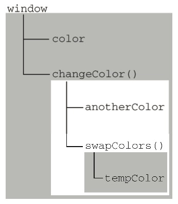
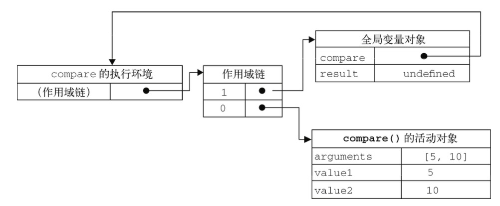
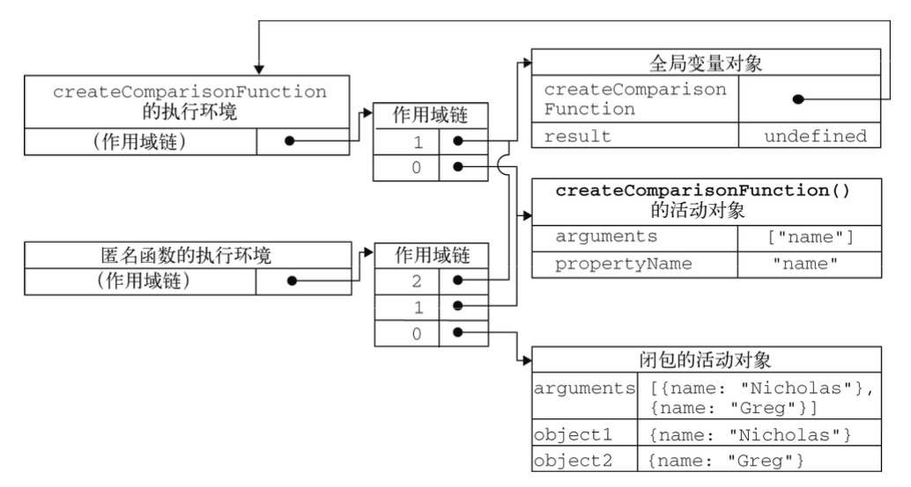

# JS的执行环境及作用域

> 摘自《JavaScript高级程序设计》

​	执行环境（execution context，有时也称为环境）是JS中最为重要的一个概念。**执行环境**定义了变量或函数有权访问的其他数据，决定了它们各自的行为。

​	每个执行环境都有一个与之关联的**变量对象**（varialbe object），环境中定义的所有变量和函数都保存在这个对象中。虽然我们编写的代码无法访问这个对象，但解析器在处理数据时会在后台使用它。

​	全局执行环境是最外围的一个执行环境。根据宿主环境的不同，表示执行环境的对象也不一样，如Web浏览器中是`window`对象，Node中是`global`，所有全局变量都是全局对象的属性。

​	某个执行环境中的所有代码执行完毕后，该环境被销毁，保存在其中的所有变量和函数定义也随之销毁（全局执行环境直到应用程序退出时才销毁）。

​	每个函数都有自己的执行环境。当执行进入一个函数时，函数的环境就会被推入一个环境栈中。而在函数执行之后，栈将其环境弹出，把执行权返回给之前的执行环境。JS程序中的执行流正式由这个机制控制的。

​	当代码在一个环境中执行时，会创建变量对象的一个**作用域链**（scope chain）。作用域链的用途是：==保证对执行环境有权访问的所有变量和函数的有序访问。==作用域的前端，始终都是当前执行的代码所在环境的变量对象。如果这个环境是函数，则将其**活动对象**（activation object）作为变量对象。

​	  活动对象在最开始的时候只包含一个变量，即`arguments`对象。作用域链中的下一个变量对象来自包含（外部）环境，而再下一个变量对象则来自下一个包含环境。这样，一直延续到全局执行环境；全局执行环境的变量对象始终都是作用域链中的最后一个对象。

​	标识符解析是沿着作用域链一级一级地搜索标识符的过程。搜索过程始终从作用域链的前端开始，然后逐级地向后回溯，直至找到标识符位置（如果找不到标识符，通常会导致错误发生）。

示例代码：

```javascript
var color = "blue";

function changeColor(){
    if(color === "blue") {
        color = "red";
    } else {
        color = "blue";
    }
}

console.log(changeColor());
```

​	在这个例子中，函数`changeColor()`的作用域链包含两个对象：它自己的变量对象（其中定义着`arguments`对象）和全局环境的变量对象。可以在函数内部访问变量`color`，就是因为可以在这个作用域链中找到它。

再看一个例子：

```javascript
var color = "blue"；

function changeColor() {
    var anotherColor = "red";
    
    function swapColors() {
        var tempColor = anotherColor;
        anotherColor = color;
        color = tmpColor;
        
        // 这里可以访问color、anotherColor和tempColor
    }
    
    // 这里可以访问color和anotherColor，但不能访问tempColor
}

// 这里只能访问color
changeColor();
```

​	以上代码共涉及3个执行环境：全局环境、changeColor()的局部环境和swapColor()的局部环境。全局环境中有一个变量`color`和一个函数`changeColor()`。changeColor()的局部环境中有一个变量`anotherColor`和一个函数`swapColors()`，但它也可以访问全局环境中的变量`color`。swapColors()的局部变量中有一个变量`tempColor`，该变量只能在这个环境中访问到。无论是全局环境还是changeColor()的局部变量都无权访问`tempColor`，然而，在swapColors()内部则可以访问其他两个环境中的所有变量，因为那两个环境是它的父执行环境。如图：



​	上图表示特定的执行环境。其中，内部环境可以通过作用域链访问所有的外部环境，但外部环境不能访问内部环境中任何变量和函数。这些环境之间的联系是线性、有次序的。每个环境都可以向上搜索作用域链，以查询变量名和函数名；但任何环境都不能通过向下搜索作用域链而进入另一个执行环境。

​	对于这个例子中的`swapColors()`而言，其作用域中包含3个对象：swapColors()的变量对象、changeColor()的变量对象和全局变量对象。swapColors()的局部环境开始时会现在自己的变量对象中搜索函数名和变量，如果搜索不到再搜索上一级作用域链。changeColor()的作用域链中只包含两个对象：它自己的变量对象和全局变量对象，也就是诉说，它不能访问swapColors()的环境。

**函数参数也被当做变量来对待，因此其访问规则与执行环境中的其他变量相同。**

## 理解JS的闭包函数

闭包是指有权访问另一个函数作用域中的函数。

创建闭包的常见方式，就是在一个函数内部创建另一个函数：

```javascript
function createComparisonFunction(propertyName) {
    return function(object1, object2) {
        let value1 = object1[propertyName];
        let value2 = object2[propertyName];
        
        if(value1 < value2) {
           return -1;
        } else if(value1 > value2) {
            return 1;
        } else {
            return 0;
        }
    };
}
```

`value1`和`value2`两行代码时内部函数（一个匿名函数）中的代码，这梁行代码访问了外部函数中的变量`propertyName`。即使这个内部函数被放回了，而且是在其他地方被调用了，但它仍然可以访问变量`propertyName`。之所以还能访问这个变量，是因为内部函数的作用域链中包含`createComparisonFunction()`的作用域。

要搞清楚其中的细节，必须从理解函数被调用的时候都会发生什么入手。

​	有关如何创建作用域链以及作用域链有什么作用的细节，对于彻底理解闭包至关重要。关于作用域链上面已经讲过，当某个函数被调用时，会创建一个执行环境及相应的作用域链。然后使用`arguments`和其他命名参数的值来初始化函数的活动对象。但在作用域链中，外部函数的活动对象始终处于第二位，外部函数的外部函数的活动对象处于第三位，······直至作为作用域链终点的全局执行环境。

​	在函数执行过程中，为读取和写入变量的值，就需要在作用域中查找变量。

---

看个例子：

```javascript
function compare(value1, value2){
	if (value1 < value2){
	    return -1;
	} else if (value1 > value2){
	    return 1;
	} else {
		return 0; 
	}
}
const result = compare(5, 10);
```

以上代码先定义了`compare()`函数，然后又在全局作用域中调用了它。当调用`compare()`时，会创建一个包含`arguments`、`value1`、`value2`的活动对象。全局执行环境的变量对象（result和compare）在`compare()`执行环境的作用域链中则处于第二位。如下图，包含了上述关系的`compare()`函数执行时的作用域链。



​	后台的每个执行环境都有一个表示变量的对象——变量对象。全局环境的变量对象始终存在，而像`compare()`函数这样的局部环境的变量对象，则只在函数执行的过程中存在。在创建`compare()`函数时，会创建一个预先包含全局变量对象的作用域链，这个作用域链被保存在内部的`[[Scope]]`属性中。当调用`compare()`函数时，会为函数创建一个执行环境，然后通过复制函数的`[[Scope]]`属性中的对象构建起执行环境的作用域链。此后，又有一个活动对象（在此作为变量对象使用）被创建并被推人执行环境作用域链的前端。对于这个例子中`compare()`函数的执行环境而言，其作用域链中包含两个变量对象：本地活动对象和全局变量对象。显然，==作用域链本质上是一个指向变量对象的指针列表，它只引用但不实际包含变量对象。==

​	无论什么时候在函数中访问一个变量时，就会从作用域链中搜索具有相应名字的变量。一般来讲，当函数执行完毕后，局部活动对象就会被销毁，内存中仅保存全局作用域（全局执行环境的变量对象)。 但是，闭包的情况又有所不同。

---

​	在另一个函数内部定义的函数会将包含函数（即外部函数）的活动对象添加到它的作用域链中。因 此，在`createComparisonFunction()`函数内部定义的匿名函数的作用域链中，实际上将会包含外部函数`createComparisonFunction()`的活动对象。

下图展示了当下列代码执行时，包含函数与内部匿名函数的作用域链。

```javascript
const compare = createComparisonFunction("name");
const result = compare({ name: "Nicholas" }, { name: "Greg" });
```



​	在匿名函数从`createComparisonFunction()`中被返回后，它的作用域链被初始化为包含 `createComparisonFunction()`函数的活动对象和全局变量对象。这样，匿名函数就可以访问在 `createComparisonFunction()`中定义的所有变量。更为重要的是，`createComparisonFunction()` 函数在执行完毕后，其活动对象也不会被销毁，因为匿名函数的作用域链仍然在引用这个活动对象。换句话说，当`createComparisonFunction()`函数返回后，其执行环境的作用域链会被销毁，但它的活 动对象仍然会留在内存中；直到匿名函数被销毁后，`createComparisonFunction()`的活动对象才被销毁。

```javascript
// 创建函数 
var compareNames = createComparisonFunction("name");
// 调用函数  
var result = compareNames({ name: "Nicholas" }, { name: "Greg" });
// 解除对匿名函数的引用，以便释放内存
compareNames = null;
```

​	首先，创建的比较函数被保存在变量`compareNames`中。而通过将`compareNames`设置为等于`null` 解除该函数的引用，就等于通知垃圾回收例程将其清除。随着匿名函数的作用域链被销毁，其他作用域 (除了全局作用域）也都可以安全地销毁了。上图展示了调用`compareNames ()`的过程中产生的作用域链之间的关系。

**注意：**由于闭包会携带包含它的函数的作用域，因此会比其他函数占用更多的内存。过度使用闭包可能会导致内存占用过多，我们建议读者只在绝对必要时再考虑使用闭包。虽然像V8等优化后的JavaScript引擎会尝试回收被闭包占用的内存，但请大家还是要慎重使用闭包。

### 闭包与变量

闭包只能取得包含函数中任何变量的最后一个值。

看下例子：

```javascript
function createFunctions(){
    var result = new Array();
    for (var i=0; i < 10; i++){
        result[i] = function(){
			return i; 
        };
	}
    return result;
}

createFunctions()[6](); // 10
```

这个函数会返回一个函数数组。表面上看，似乎每个函数都应该返自己的索引值，即位置`0`的函数返回`0`,位置`1`的函数返回`1`，以此类推。但实际上，每个函数都返回`10`。因为每个函数的作用域链中都保存着 `createFunctions ()`函数的活动对象，所以它们引用的都是同一个变量` i`。当 `createFunctions ()`函数返回后，变量`i`的值是10，此时每个函数都引用着保存变量i的同一个变量 对象，所以在每个函数内部`i`的值都是10。

使用var声明的变量全局有效，使用let就可以避免这个问题：

```javascript
function createFunctions(){
    var result = new Array();
    for (let i=0; i < 10; i++){
        result[i] = function(){
			return i; 
        };
	}
    return result;
}

createFunctions()[6](); // 6
```

变量`i`是`let`声明的，当前的`i`只在本轮循环有效，所以每一次循环的`i`其实都是一个新的变量，每次`for`循环的变量`i`，都会保存在块级作用域的活动对象中，所以最后输出的是`6`。

### 关于this对象

在ES5中，在比保重使用`this`对象会导致一些问题。`this`对象是在运行时基于函数的执行环境绑定的：在全局中，`this`是全局执行环境对象，而当函数被作为某个对象的方法调用时，`this`等于那个对象。

来看看下面代码：

```javascript
var name = "The Window";
var object = {
    name : "My Object",
    getNameFunc : function(){
        return function(){
            return this.name;
        };
} };
alert(object.getNameFunc()()); // "The Window" (在非严格模式下)
// Cannot read property 'name' of undefined (在严格模式下)
```

上面代码`getNameFunc()`返回一个匿名函数，而匿名函数又返回`this.name`，然而，例子的返回字符串是The Window，即全局name变量的值。前面提到过，==每个函数在被调用的时候会自动取得两个特殊变量：`this`和`arguments`。==内函数在搜索这两个变量时，只会搜索到其活动对象为止，因此永远不可能直接访问外部函数中的这两个变量。解决方法可以把作用域中的`this`对象保存在一个闭包能够访问的变量里，就可以让闭包访问该对象了；或者使用ES6的箭头函数

```javascript
var name = "The Window";
var object = {
    name : "My Object",
    getNameFunc : function(){
        var that = this;
        return function(){
            return that.name;
        };
} };
console.log(object.getNameFunc()()); // My Object

var object2 = {
    name : "My Object",
    getNameFunc : function(){  
        return () => {
            return this.name;
        };
} };

console.log(object2.getNameFunc()()); // My Object
```

