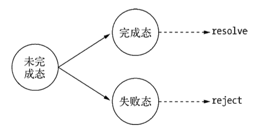
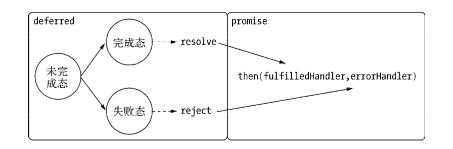

# 异步编程

## 函数式编程

JavaScript中的函数基本上可以为所欲为，无论是调用它，或者作为参数，或者作为返回值均可，拥有者至高无上的能力。函数作为`JavaScript`异步编程的基础，先了解`JavaScript`现如今的回调函数和深层嵌套是很有必要的。

### 1.高阶函数

**高阶函数可以把函数作为参数，或是将函数作为返回值的函数。**如：

```javascript
function foo (x) {
    return function () {
        return x;
    };
}
```

高阶函数除了通常意义的函数调用返回外，还形成了一种后续传递风格的结果接收方式，而非单一的返回值形式。后续传递风格的程序编写将函数的业务重点从返回值转移到了回调函数中：

```javascript
function foo (x,bar) {
    return bar(x);
}
```

上面函数中，对于相同的`foo()`函数，传入的`bar`不同，则可以得到不同的结果。一个经典的例子是数组的`sort()`方法，可以接受一个方法作为参数参与运算排序：

```javascript
var points = [40, 100, 1, 5, 25, 10]; points.sort(function(a, b) {
	return a - b; 
});
// [ 1, 5, 10, 25, 40, 100 ]
```

通过改动`sort()`方法的参数，可以决定不同的排序方式，从这里可以看出高阶函数的灵活性来。

​	结合`Node`提供的最基本的事件模块可以看出，事件的处理方式正式基于高阶函数的特性来完成的。在自定义事件实例中，通过为相同事件注册不同的回调函数，可以很灵活地处理业务逻辑。

```javascript
var emitter = new events.EventEmitter();
emitter.on('event_foo', function () {
    // TODO
});
```

事件可以很方便地进行复杂业务逻辑的解耦，它其实受益于高阶函数。

### 2.偏函数用法

 **偏函数用法是指创建一个调用另外一个部分—参数或变量已经预置的函数—的函数的用法。**WTF

举例：

```javascript
var toString = Object.prototype.toSting;
var isString = function (obj) {
    return toString.call(obj) == '[object Stirng]';
}

var isFunction = function (obj) {
    return toString.call(obj) == '[object Function]';
}
```

在`JavaScript`进行类型判断时，通常会定义类似的代码，但这种方式需要重复去定义一些相似的代码，如果有更多的`isXXX()`，就会出现更多的荣域代码。为解决此问题，我们引入一个新的函数，这个函数可以像工厂一样批量创建一些类似的函数：

```javascript
var isType = function (type) { 
    return function (obj) {
		return toString.call(obj) == '[object ' + type + ']'; 
    };
};
var isString = isType('String');
var isFunction = isType('Function');
```

这样就会简单很多，这种通过指定部分参数来产生一个新的定值函数的形式就是偏函数。

## 异步编程

目前，异步编程的主要解决方案有如下三种：

* 事件发布/订阅模式
* Promise/Deferred模式
* 流程控制库

### 1.事件发布/订阅模式

事件监听器是一种广泛应用于异步编程的模式，是回调函数的事件化，又称发布/订阅模式。

`Node`自身提供的`events`模块就是此模式的一个简单实现。`Node`中部分模块都继承自它。事件发布/订阅模式操作很简单，示例如下：

```javascript
// 订阅
emitter.on("event1", function (message) {
    console.log(message);
});

// 发布
emitter.emit("event1", "I am message!");
```

​	事件发布/订阅模式可以实现一个事件与多个回调函数关联，这些函数又叫事件侦听器。通过`emit()`发布时间后，消息会立即传递给当前事件的所有侦听器执行。这种模式本身并无同步和异步的问题，但在`Node`中，`emit()`调用多半是伴随事件循环而异步触发的，所以事件发布/订阅广泛用于异步编程。

​	在一些典型的场景中，可以 过事 发布/订阅模式进行组件封装，将不变的部分封装在组件内部，将容易变化、需要自定义的部分通过事件暴露给外部处理，这是一种典型的逻辑分离方式。从另一个角度看，事件侦听器模式也是一种钩子（hook）机制，利用钩子导出内部数据或状态给外部调用者。

#### 利用异步解决队列雪崩问题

​		事件订阅/发布模式中，有`once()`方法，通过它添加的侦听器只执行一次，在执行之后就会将它与事件的关联移除。利用这个特性可以帮助我们过滤一些重复性的事件响应。

​	所谓雪崩问题，就是在高访问量、大并发的情况下缓存失效的情景，此时大量的请求同时涌入数据库中，数据库无法同时承受如此大的查询请求，进而影响到网站的整体相应速度。

​	以下是一个数据库查询语句：

```javascript
const select = function (callback) {
    db.select('SQL', function (results) {
        callback(results);
    });
}
```

​	如果站点刚好启动，这时缓存数据是不存在的，而如果访问量巨大，同一句SQL会被发送到数据库中反复查询，会影响服务器整体性能。一种改进方案是添加一个状态锁，相关代码如下：

```javascript
let status = 'ready';
const select = function (callback) {
    if (status === 'ready') {
        status = 'pending';
        db.select('SQL', function (results) {
        	status = 'ready';
            callback(results);
    	});
    }
};
```

这种情况下只有第一次是有效的，其余的都无数据返回。这时可以引入事件队列，相关代码如下：

```javascript
const proxy = new events.EventEmitter();
let status = 'ready';
const select = function (callback) {
    proxy.once('selected', callback);
    if(status === 'ready') {
        status = 'pending';
        db.select('SQL', function (resules) {
            proxy.emit('selected', results);
            status = 'ready';
        });
    }
};
```

利用`once()`方法，将所有的请求回调都压入事件队列中，利用其执行一次就会将监视器移除的特点，保证每一个回调只会执行一次。SQL在进行查询时，新到来的相同调用只需在队列中等待数据就绪即可，一旦查询结束，得到的结果可以被这些调用共同使用。

#### 多异步指尖的协作方案

以渲染页面所需要的模板读取、数据读取和本地化资源读取为例简要介绍，相关代码如下：

```javascript
let count = 0;
let results = {};
const done = function (key, value) {
    result[key] = value;
    count++;
    if(count === 3) {
        // 渲染页面
        render(results);
    }
};

fs.readFile(template_path, 'utf8', function (err, template) {
    done('template', template);
});

db.query(sql, function (err, data) {
	done("data", data); 
});
l10n.get(function (err, resources) { 		    
    done("resources", resources);
});
```

​	由于多个异步场景中回调函数的执行并不能保证顺序，且回调函数之间互相没有任何交集，所以需要借助一个第三方函数和第三方变量来处理异步协作的结果。通常把这个用于检测次数的变量叫做**哨兵变量**。利用偏函数来处理哨兵变量和第三方函数的关系，相关代码如下：

```javascript
const after = function (times, callback) {
    let count, results = {};
    return function (key, value) {
        results[key] = value;
        count++;
        if(count === times) {
            callback(results);
        }
    }
}

const done = after(times, render);
```

​	上述方法实现多对一的目标。如果业务继续增长，我们依然可以继续利用发布/订阅方式来完成多对多的方案，相关代码如下：

```javascript
var emitter = new events.Emitter(); 
var done = after(times, render);

emitter.on("done", done); 
emitter.on("done", other);

fs.readFile(template_path, "utf8", function (err, template) {
    emitter.emit("done", "template", template);
});
db.query(sql, function (err, data) {
    emitter.emit("done", "data", data);
});
l10n.get(function (err, resources) {
    emitter.emit("done", "resources", resources);
});
```

这种方案结合了前者用简单的偏函数完成了多对一的收敛和时间订阅/发布模式中一对多的发散。

### 2.Promise/Deferred模式

`Promise/Deferred`是典型的异步模式，它的使用使得回调、嵌套所产生的深层嵌套问题在一定程度上得到了缓解。这里着重介绍`Promise/A`来以点带面介绍`Promise/Deferred`模式。

#### Promise/Deferred基本介绍

`Promise/Deferred`模式包含两部分，即`Promise`和`Deferred`，两者的差别暂且不说，先来看前者。

`Promise/A`提议对单个异步操作做出了这样的抽象定义：

* `Promise`操作只会处在3中状态的一种：未完成态`pending`、完成态`fulfilled`和失败态`rejected`。只有异步操作的结果，可以决定当前是哪一种状态，任何其他操作都无法改变这个状态。
* `Promise`的状态只会出现从未完成态向完成态或失败态转化，不能逆反。完成态和失败态不能互相转化。
* `Promise`的状态一旦转化，将不能被更改。

一个`Promise`只要具备`then()`方法即可。对于`then()`方法有以下要求：

* 接受完成态、错误态的回调方法。在操作完成或出现错误时，将会调用对应方法。

* 可选地支持`progress`事件回调作为第三个方法。

* `then()`方法只接受`function`对象，其余对象将被忽略。

* `then()`方法继续返回`Promise`对象，以实现链式调用。

  方法定义：

  ````javascript
  then(fulfilledHandler, errorHandler, progressHandler)
  ````

下面通过继承`Node`的`events`模块来完成一个简单的实现，相关代码如下：

```javascript
const Promise = function () {
    EventEmitter.call(this);
}
util.inherrits(Promise, EventEmitter);

Promise.prototype.then = function (fulfilledHandler, errorHandler, progressHandler) {
    if(typeof fulfilledHandler === 'function') {
        // 利用once()方法，保证成功回调只执行一次
        this.once('success', fulfilledHandler);
    } 
    if(typeof errorHandler === 'function') {
        // 利用once()方法，保证异常回调只执行一次
        this.once('error', errorHandler);
    }
    if(typeof progressHanlder === 'function') {
        this.on('progress', progressHandler);
    }
    return this;
}
```

​	这里可以看到`the()`方法所做的事情是将回调函数存放起来。为了完成整个流程，还需要触发执行这些回调函数的地方，实现这些功能的对象通常被称为`Deferred`，即延迟对象。代码如下：

```javascript
const Deferred = function () {
    this.state = 'unfulfilled';
    this.promise = new Promise();
};

Deferred.prototype.resolve = function(obj) {
    this.state = 'fulfilled';
    this.promise.emit('success', obj);
};

Deferred.prototype.reject = function (err) {
    this.state = 'failed';
    this.promise.emit('error', err);
};

Deferred.prototype.progress = function (data) {
    this.promise.emit('progrress', data);
}
```



利用Promise/A提议模式，可以对一个典型对象进行封装，相关代码如下：

```javascript
res.setEncoding('utf8');
res.on('data', function (chunk) {
    console.log('BODY:' + chunk);
});
res.on('end', function () {
    // Done
});
res.on('error', function (err) {
    // Error
});
```

上述代码可以转换为如下的简略格式：

```javascript
res.then(function () {
    // Done
}, function (err) {
    // Error
}, function (chunk) {
    console.log('BODY:' + chunk);
});
```

要实现这样的API，只需要简单地改造一下即可：

```javascript
const promisify = function (res) {
    const deferred = new Deferred();
    const result = '';
    res.on('data', function (chunk) {
        result += chunk;
        deferred.progress(chunk);
    });
   	res.on('end', function () { 
		deferred.resolve(result);
   	});
	res.on('error', function (err) {
		deferred.reject(err); 
	});
	return deferred.promise;
}
```

这里返回`deferred.promise`的目的是为了不让外部程序调用`resolve()`和`reject()`方法，更改内部状态的行为交由定义者处理。下面是定义好`Promise`后的调用示例：

```javascript
promisify(res).then(function () { 
    // Done
}, function (err) { 
    // Error
}, function (chunk) {
    // progress
    console.log('BODY: ' + chunk);
});
```

这里回到`Promise`和`Deferred`的差别上。从上面的代码可以看出，`Deferred`主要用于内部，用于维护异步模型的状态；`Promise`则作用于外部，通过`then()`方法暴露给外部以添加自定义逻辑。



​		与事件发布/订阅模式相比，`Promise/Deferred`模式的API接口和抽象模型都十分简洁。从图中可以看出，它将业务中不可变的部分封装在`Deferred`中，将可变的部分交给了`Promise`。此时，对于不同的场景，都需要去封装和改造其`Deferred`部分，然后才能得到简洁的接口。如果场景不常用，封装花费的时间与 带来的简洁相比并不一定划算。

​         `Promise`是高级接口，事件是低级接口。低级接口可以构成更多更复杂的场景，高级接口一旦定义，不太容易变化，不再有低级接口的灵活性，但对于解决典型问题非常有效。

#### Promise中的多异步协作

当我们需要处理多个异步调用时，原理类似于此：

```javascript
Deferred.prototype.all = function () {
    let count = promises.length;
    let results = [];
    promises.forEach((promise, i) => {
        promise.then((data) => {
           	count--;
            results[i] = data;
            if(count === 0) {
                this.resolve(results);
            }
        }, error => {
            this.reject(err)
        });
    });
    return this.promise;
}
```

对于多次文件读取场景，下面代码使用`all()`方法将两个单独的`Promise`组合成一个新的：

```javascript
var promise1 = readFile("foo.txt", "utf-8");
var promise2 = readFile("bar.txt", "utf-8");
var deferred = new Deferred();
deferred.all([promise1, promise2]).then(function (results) {
    // TODO
}, function (err) {
    // TODO 
});
```

这里通过`all()`方法抽象多个异步操作。只有所有异步操作成功，这个异步操作才算成功，一旦其中一个异步操作失败，整个异步操作就失败。


#### Promise队列操作

在`Node`中，异步是不可或缺的，有时在使用时，需要多个异步按顺序依次进行，以前在实现过程中，回调地狱就这样出现了。

代码大致如下:

```javascript
obj.api1(function (value1) {
    obj.api2(value1, function (value2) {
        obj.api3(value2, function (value3) {
            obj.api4(value3, function (value4) {
                callback(value4);
            });
        });
    });
});
```

由于每个按步骤执行，所以不得不进行嵌套执行。多个嵌套会让代码变得很丑。

利用Promise进行序列化执行，理想的编程体验应该是**前一个的调用结果作为下一个调用的开始**，即链式调用。代码如下：

```javascript
promise()
	.then(obj.api1)
	.then(obj.api2)
	.then(obj.api3)
	.then(obj.api4)
    .then(function (value4) {
    	// do something with value4
	}, function (error) {
    	// handle any error from step1
	})
	.done();
```

尝试改变一下代码以实现链式调用，具体如下：

```javascript
const Promise = function () {
    // 队列用于存储待执行的回调函数
    this.queue = [];
    this.isPromise = true;
}

Promise.prototype.then = function (fulfilledHandler, errorHandler, progressHandler) {
    const handler = {};
    if(typeof fulfilledHandler === 'function') {
        handler.fulfilled = fulfilledHandler;
    }
    if(typeof errorHandler === 'function') {
        handler.error = errorHandler;
    }
    this.queue.push(handler);
    return this;
}

const Deferred = function () {
    this.promise = new Promise();
}

// 完成态
Deferred.prototype.resolve = function (obj) {
    const promise = this.promise;
    let handler;
    while((handler = promise.queue.shift())) {
        if (handler && handler.fulfilled) {
            const ret = handler.fulfilled(obj);
            if(ret && ret.isPromise) {
                ret.queue = promise.queue;
                this.promise = ret;
                return;
            }
        }
    }
};

// 失败态
Deferred.prototype.reject = function (err) {
    const promise = this.promise;
    let handler;
    while((handler = promise.queue.shift())) {
        if (handler && handler.error) {
            const ret = handler.error(err);
            if(ret && ret.isPromise) {
                ret.queue = promise.queue;
                this.promise = ret;
                return;
            }
        }
    }
};

// 生成回调函数
Deferred.prototype.callback =function () {
    return (err, file) => {
        if(err) {
            return this.reject(err);
        }
        return this.resolve(file);
    }
}

```

下面以两次文件读取作为例子，验证设计的可行性。假设读取第二个文件是依赖于第一个文件中的内容，相关代码如下：

```javascript
var readFile1 = function (file, encoding) {
    var deferred = new Deferred();
    fs.readFile(file, encoding, deferred.callback()); 
    return deferred.promise;
};
var readFile2 = function (file, encoding) {
    var deferred = new Deferred();
    fs.readFile(file, encoding, deferred.callback()); 
    return deferred.promise;
};

readFile1('file1.txt', 'utf8').then(function (file1) {
    return readFile2(file1.trim(), 'utf8');
}).then(function (file2) {
    console.log(file2);
});
```

执行这段代码，将会得到输出结果：

```shell
$ node sequence.js
I am file2.
```

要让Promise支持链式操作，主要通过以下两个步骤：

1. 将所有的回调都存到队列中。
2. Promise完成时，逐个执行回调，一旦检测到返回了新的`Promise`对象，停止执行，然后将当前`Deferred`对象的`promise`引用改为新的`Promise`对象，并将队列中余下的回调转交给它。

**将API Promise化**

```javascript
// smooth(fs.readFile);
var smooth = function (method) {
    return function () {
        var deferred = new Deferred();
        var args = Array.prototype.slice.call(arguments, 1); 
        args.push(deferred.callback());
        method.apply(null, args);
        return deferred.promise;
    };
};
```

于是之前的调用可以简化为：

```javascript
var readFile = smooth(fs.readFile);
readFile1('file1.txt', 'utf8').then(function (file1) {
    return readFile2(file1.trim(), 'utf8');
}).then(function (file2) {
    // file2 => I am file2
    console.log(file2);
});
```

