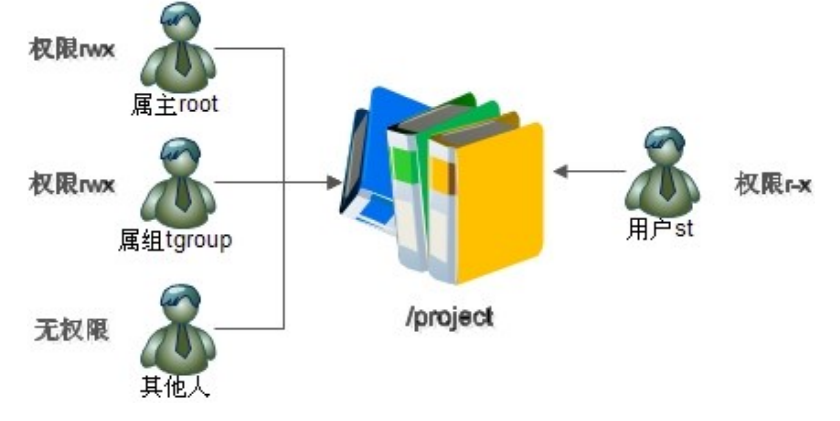

# 小视频笔记(三)

[TOC]

# 8 权限管理

## 8.1 ACL权限

## 8.1.1 ACL权限简介与开启

### 1.权限简介

Linux的文件有所有者，所属组，其他人三种权限，但这是远远不够的，比如说，有一个project，项目管理员将所有项目人员添加到该项目的所属组中，分配权限770，有一天，临时来了一个成员，该成员需要先进行学习，然后才能工作，这时我们需要对该成员对project分配读和可执行的权限，不能将其他人权限设为5，文件只有一个所属组，所以对project分配两个所属组的方式不成立，显然此时的权限管理方式无法满足要求，这时候就用到ACL权限了，所谓的ACL权限，可以简单的理解为为某一用户或某一组分配不属于所有，所属组，其他人的额外权限。



### 2.查看分区ACL权限是否开启

```shell
# 查看分区使用状况
~ andy$ df -h
Filesystem      Size   Used  Avail Capacity iused      ifree %iused  Mounted on
/dev/disk1     112Gi   61Gi   51Gi    55% 1632930 4293334349    0%   /
devfs          182Ki  182Ki    0Bi   100%     632          0  100%   /dev
map -hosts       0Bi    0Bi    0Bi   100%       0          0  100%   /net
map auto_home    0Bi    0Bi    0Bi   100%       0          0  100%   /home
```


# 命令格式：

`dumpefs [选项] 分区路径`

​	查询指定分区详细文件系统信息的命令 

选项: 

​	-h 仅显示超级块中信息，而不显示磁盘块组的详细信 息 

```shell
 dumpe2fs -h /dev/sda3
 
```

### 3.临时开启分区ACL权限

``` #重新挂载根分区，并挂载加入acl权限$ mount -o remount,acl /

# ### 4.永久开启分区ACL权限

​```shell
[root@localhost ~]# vi /etc/fstab
UUID=c2ca6f57-b15c-43ea-bca0-f239083d8bd2 / ext4 defaults,acl #加入acl
[root@localhost ~]# mount -o remount /
#重新挂载文件系统或重启动系统，使修改生效
```

**注：** fastab是系统开机启动默认挂载的文件