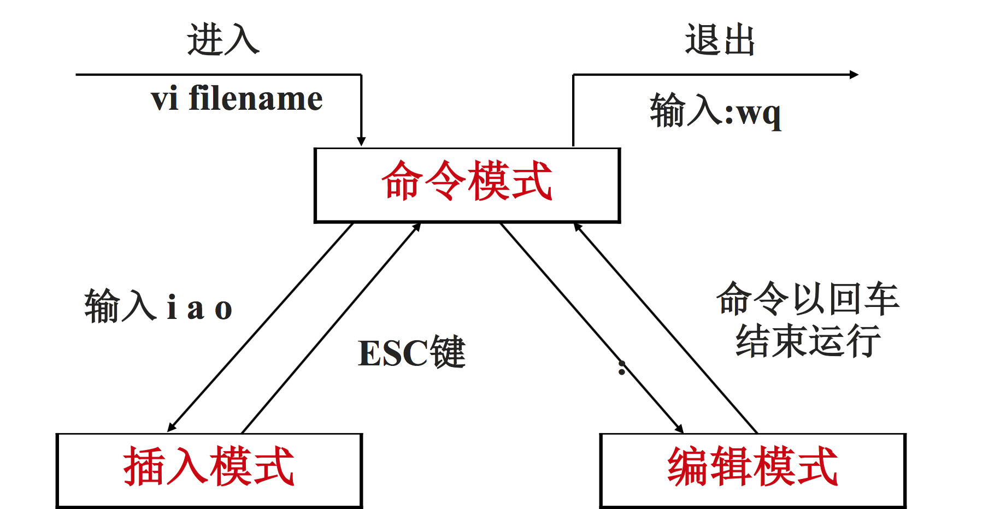
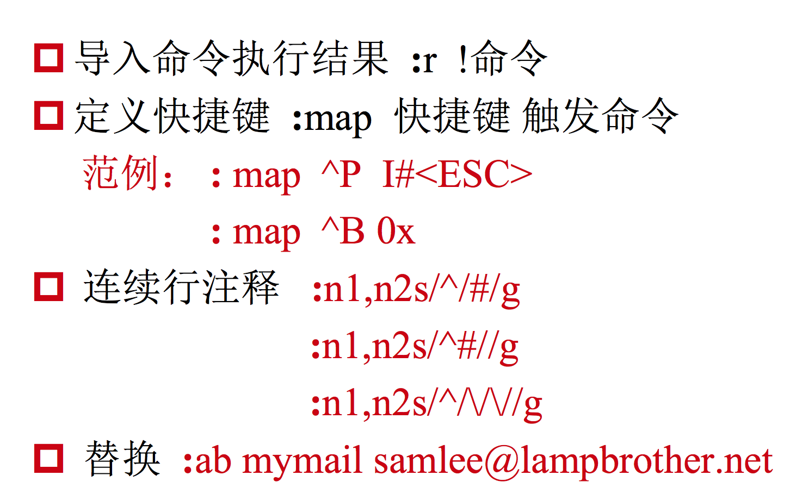

# 小视频笔记（二）

[TOC]


# 5.文本编辑器Vim

## 5.1 Vim简介

Vim是一个功能强大的全屏幕文本编辑器，是Linux/UNIX上最常用的文本编辑器，它的作用是建立、编辑、显示文本文件。

**Vim 没有菜单，只有命令。**

## 5.2 Vim工作模式



## 5.3 常用操作

### 5.3.1 插入命令

| 命令   | 作用         |
| ---- | ---------- |
| a    | 在光标所在字符后插入 |
| A    | 在光标所在行尾插入  |
| i    | 在光标所在字符前插入 |
| I    | 在光标所在行行首插入 |
| o    | 在光标下插入新航   |
| O    | 在光标上插入新航   |

### 5.3.2 定位命令

| 命令         | 作用         |
| ---------- | ---------- |
| : set nu   | 设置行号       |
| : set nonu | 取消行号       |
| gg/G       | 到第一行/到最后一行 |
| nG         | 到第n行       |
| : nG       | 到第n行       |
| $          | 移至行尾       |
| 0          | 移至行首       |

### 5.3.3 删除命令

| 命令      | 作用              |
| ------- | --------------- |
| x       | 删除光标所在处字符       |
| nx      | 删除光标所在处后n个字符    |
| dd      | 删除光标所在行，ndd删除n行 |
| dG      | 删除光标所在行到文件末尾内容  |
| D       | 删除光标所在处到行尾内容    |
| :n1,n2d | 删除指定范围的行        |

### 5.3.4 复制和剪切命令

| 命令   | 作用             |
| ---- | -------------- |
| yy   | 复制当前行          |
| nyy  | 复制当前行以下n行      |
| dd   | 剪切当前行          |
| ndd  | 剪切当前行以下n行      |
| p、P  | 粘贴在当前光标所在行下或行上 |

### 5.3.5 替换和取消命令

| 命令   | 作用                  |
| ---- | ------------------- |
| r    | 取代光标所在处字符           |
| R    | 从光标所在处开始替换字符，按Esc结束 |
| u    | 取消上一步操作             |

### 5.3.6 搜索和搜索替换命

| 命令                | 作用                        |
| ----------------- | ------------------------- |
| /string           | 搜索指定字符串；搜索时忽略大小写`:set ic` |
| n                 | 搜索指定字符串的下一个出现位置           |
| :%s/old/new/g     | 全文替换指定字符串                 |
| :n1,n2s/old/new/g | 在一定范围内替换指定字符串             |

### 5.3.7 存和退出命令

| 命令              | 作用                     |
| --------------- | ---------------------- |
| :w              | 保存修改                   |
| :w new_filename | 另存为指定文件                |
| :wq             | 保存修改并退出                |
| ZZ              | 快捷键，保存修改并退出            |
| :q!             | 不保存修改退出                |
| :wq!            | 保存修改并退出（文件所有者及root可使用） |

## 5.4 使用技巧




**注：**

* `:r 文件路径` 可以直接把文件导入光标所在的文件 
* 设置好的快捷键在重启之后会失效，可以在宿主目录下创建vim的配置文件，用户的家目录下，文件名字叫做`.vimrc`
* 普通用户在` /home/username/.vimrc`；Root用户在 `/root/.vimrc`

# 6 软件包管理

## 6.1 软件包管理简介

### 6.1.1 软件包分类和各自优缺点

分类：

* 源码包
* 二进制包（RPM包、系统默认包）

**源码包**

优点：

* 开源，如果有足够的能力，可以修改源代码
* 可以自由选择所需的功
* 能软件是编译安装，所以更加适合自己的系统，更加稳定也效率更高卸载方便
* 卸载方便

缺点：

* 安装过程步骤较多，尤其安装较大的软件集合时(如LAMP环境搭建)，容易出现拼写错误
* 编译过程时间较长，安装比二进制安装时间长
* 因为是编译安装，安装过程中一旦报错新手很难解决

**RPM包（二进制包）**

优点：

* 包管理系统简单，只通过几个命令就可以实现包的安装、升级、查询和卸载
* 安装速度比源码包安装快的多

缺点：

* 经过编译，不再可以看到源代码
* 功能选择不如源码包灵活
* 依赖性

## 6.2 RPM包管理

### 6.2.1 RPM命令管理

RPM包命名原则：`httpd-2.2.15-15.el6.centos.1.i686.rpm`

| 字段         | 含义                                |
| ---------- | --------------------------------- |
| httpd      | 软件包名                              |
| 2.2.15     | 软件版本                              |
| 15         | 软件发布的次数                           |
| el6.centos | 适合的Linux平台                        |
| i686       | 适合的硬件平台；`noarch`或者没有写，表示适合所有的硬件平台 |
| rpm        | rpm包扩展名                           |

### 6.2.2 RPM包依赖性

包依赖性分为三种：

1. 树形依赖： `a->b->c`； 安装顺序是cba，卸载顺序是abc
2. 环形依赖：`a->b->c->a` ；这种依赖关系的解决办法是abc一条命令同时安装
3. 模块依赖： [模块依赖查询网站](http://www.rpmfind.net/)

==这种方案可以安装包，但是依赖问题很难解决，更好的方案是使用yum安装==

### 6.2.3 安装升级和卸载

### 6.2.4 RPM包查询

### 6.2.5 检验与文件提取

## 6.3 yum在线管理

### 6.3.1 网络yum源

```shell
$ vim /etc/yum.repos.d/CentOS-Base.repo
# CentOS-Base.repo
#
# The mirror system uses the connecting IP address of the client and the
# update status of each mirror to pick mirrors that are updated to and
# geographically close to the client.  You should use this for CentOS updates
# unless you are manually picking other mirrors.
#
# If the mirrorlist= does not work for you, as a fall back you can try the 
# remarked out baseurl= line instead.
#
#
[base]
name=CentOS-$releasever - Base
mirrorlist=http://mirrorlist.centos.org/?release=$releasever&arch=$basearch&repo=os&infra=$infra
#baseurl=http://mirror.centos.org/centos/$releasever/os/$basearch/
gpgcheck=1
gpgkey=file:///etc/pki/rpm-gpg/RPM-GPG-KEY-CentOS-7

#released updates 
[updates]
name=CentOS-$releasever - Updates
mirrorlist=http://mirrorlist.centos.org/?release=$releasever&arch=$basearch&repo=updates&infra=$infra
#baseurl=http://mirror.centos.org/centos/$releasever/updates/$basearch/
gpgcheck=1
gpgkey=file:///etc/pki/rpm-gpg/RPM-GPG-KEY-CentOS-7

#additional packages that may be useful
[extras]
name=CentOS-$releasever - Extras
mirrorlist=http://mirrorlist.centos.org/?release=$releasever&arch=$basearch&repo=extras&infra=$infra
#baseurl=http://mirror.centos.org/centos/$releasever/extras/$basearch/
gpgcheck=1
gpgkey=file:///etc/pki/rpm-gpg/RPM-GPG-KEY-CentOS-7

#additional packages that extend functionality of existing packages
[centosplus]
name=CentOS-$releasever - Plus
mirrorlist=http://mirrorlist.centos.org/?release=$releasever&arch=$basearch&repo=centosplus&infra=$infra
#baseurl=http://mirror.centos.org/centos/$releasever/centosplus/$basearch/
gpgcheck=1
enabled=0
gpgkey=file:///etc/pki/rpm-gpg/RPM-GPG-KEY-CentOS-7

```

这些容器，默认会使用base 这些默认就是配好的

| 字段         | 含义                                       |
| ---------- | ---------------------------------------- |
| [base]     | 容器名称，一定要放在[]中                            |
| name       | 容器说明，可以自己随便写点什么                          |
| mirrorlist | 镜像站点，可以注释掉                               |
| baseurl    | 我们的yum源服务器的地址。默认是CentOS官方的yum源服务器，是可以使用的，如果你觉得慢可以改成你喜欢的yum源地址 |
| enabled    | 此容器是否生效，如果不写或写成enable=1都是生效，写成enable=0就是不生效 |
| gpgcheck   | 如果是1是指RPM的数字证书生效，如果是0则不生效                |
| gpgkey     | 数字证书的公钥文件保存位置。不用修改                       |

### 6.3.2 常用yum命令

1. 查询

   ```shell
   #查询所有可用软件包列表
   $ yum list 
   apr-devel.x86_64                         1.4.8-3.el7_4.1                @updates
   apr-util.x86_64   (软件包)                1.5.2-6.el7 (版本号)            @base (容器)   
   apr-util-devel.x86_64                    1.5.2-6.el7                    @base   
   audit.x86_64                             2.7.6-3.el7                    @base   
   audit-libs.i686                          2.7.6-3.el7                    @base   
   audit-libs.x86_64                        2.7.6-3.el7                    @base 

   #搜索服务器上所有和关键字相关的包
   $ yum search 关键字
   ```

2. 安装

   ```shell
   # install 安装 -y 自动回答yes
   $ yum –y install 包名
   ```

3. 升级

   ```shell
   $ yum -y update 包名
   ```

   yum –y update 如果不加包名，就是升级linux中所有的软件包，包括linux内核等都会升级，小心。如果升级，后面请跟包名。

4. 卸载

   ```shell
   $ yum -y remove 包名
   ```

   卸载也要慎用，卸载包a会把所有的依赖包都卸载，当然这些依赖包也可能被其他包使用，或被系统使用，这样在卸载a之后可能会出现很多问题。用什么装什么，尽量不卸载

### 6.3.3 yum软件组管理命令

```shell
# 列出所有可用的软件组列表
$ yum grouplist

# 安装指定软件组，组名可以由grouplist查询出来
$ yum grouopinstall 软件组名

# 卸载指定软件组
$ yum groupremove 软件组名
```

注： 软件组名要用双引号引起来

### 6.3.4 光盘yum源

搭建步骤：

1. 挂载光盘

   ```shell
   $ mount /dev/cdrom /mnt/cdrom/
   ```

2. 让网络yum源失效

   ```shell
   $ cd /etc/yum.repos.d/
   $ mv CentOS-Base.repo \ CentOS-Base.repo.bak
   $ mv CentOS-Debuginfo.repo \CentOS-Debuginfo.repo.bak
   $ mv CentOS-Vault.repo \ CentOS-V ault.repo.bak
   ```

3. 修改光盘yum源文件

   ```shell
   $ vim CentOS-Media.repo [c6-media]
   name=CentOS-$releasever - Media baseurl=file:///mnt/cdrom #地址为你自己的光盘挂载地址
   # file:///media/cdrom/
   # file:///media/cdrecorder/
   #注释这两个不存在的地址
   gpgcheck=1
   enabled=1 #把enabled=0改为enabled=1，让这个yum源配置文件生效 
   gpgkey=file:///etc/pki/rpm-gpg/RPM-GPG-KEY-CentOS-6  # /// 第三个斜杠是根目录
   ```

### 6.3.5 源码包和rpm包的区别

1. 两者的区别在于安装之前概念上的区别（上面已讲）和安装之后安装位置不同：

   **RPM包安装位置：**

   是安装在默认位置中，RPM包默认安装路径是：

   | /etc/           | 配置文件安装目录      |
   | --------------- | ------------- |
   | /usr/bin/       | 可执行的命令安装目录    |
   | /usr/lib/       | 程序所使用的函数库保存位置 |
   | /usr/share/doc/ | 基本的软件使用手册保存位置 |
   | /usr/share/man/ | 帮助文件保存位置      |

   ==所有的rpm包安装基本都遵守这个安装位置==

   **源码包安装位置：**安装在指定位置当中，一般是`/usr/local/软件名/`

2. 安装位置不同带来的影响

   RPM包安装的服务可以使用系统服务管理命令(service)来管理，不需要再配置；源码包安装可以直接使用绝对路径来进行服务的管理，或者自己去配置service来管理。

# 7 用户和用户组管理

## 7.1 用户配置文件

越是对服务器安全性要求高的服务器，越需要建立合理的用户权限等级制度和服务器操作规范。

在Linux中主要是通过用户配置文件来查看和修改用户信息。

### 7.1.1 用户信息文件

```shell
$ more /etc/passwd
root:x:0:0:root:/root:/bin/bash
bin:x:1:1:bin:/bin:/sbin/nologin
daemon:x:2:2:daemon:/sbin:/sbin/nologin
adm:x:3:4:adm:/var/adm:/sbin/nologin
sync:x:5:0:sync:/sbin:/bin/sync
shutdown:x:6:0:shutdown:/sbin:/sbin/shutdown
halt:x:7:0:halt:/sbin:/sbin/halt
mail:x:8:12:mail:/var/spool/mail:/sbin/nologin
redmine:x:1008:1008::/home/redmine:/bin/bash
saslauth:x:994:76:Saslauthd user:/run/saslauthd:/sbin/nologin
apache:x:48:48:Apache:/usr/share/httpd:/sbin/nologin
postgres:x:26:26:PostgreSQL Server:/var/lib/pgsql:/bin/bash
lisong:x:1009:1010::/home/lisong:/bin/bash
huarong:x:1010:1011::/home/huarong:/bin/bash
```

`/etc/passwd`字段含义：

这个文件中每一行代表一个用户，而且每个字段用：分割，总共7个字段

* 第1字段：用户名称
* 第2字段：密码标志早期的密码是直接放在这个文件中的，现在的密码放在了影子文件`/etc/shadow`，为什么这样做，是因为`passwd`文件的默认权限是**644**，`shadow`文件的默认权限是**000**，除了root用户，任何用户都不能读这个文件，增强系统的安全性； `x`表示需要密码登录，登录的时候回去`shadow`中找密码进行验证，没`x`就会认为没有密码，用户可以直接登录，这种登录只允许本机登录，远程是不允许的。
* 第3字段：UID(用户ID) 
  * 0	                        超级用户
  * 1-499                      系统用户（伪用户） 用户不能登录，不能删除，删除系统会崩溃
  * 500-65535              普通用户
* 第4字段：GID（用户初始组ID） 每个用户创建时，就会创建出一个同名的初始组，初始组不可或缺，并且每个用户只能有一个初始组，初始组可以改，但只能是一个。初始组并不推荐更改
* 第5字段：用户说明
* 第6字段：家目录
  * 普通用户：`/home/用户名/`
  * 超级用户：`/root/`      
* 第7字段：登录之后的Shell

**注：**

初始组和附加组：

1. 初始组：	就是指用户一登录就立刻拥有这个用户组的相关权限，每个用户的初始组只能有一个，一般就是和这个用户的用户名相同的组名作为这个用户的初始组。
2. 附加组：指用户可以加入多个其他的用户组，并拥有这些组的权限，附加组可以有多个。

SHell是什么：

1. Shell就是Linux的命令解释器。命令解释器：比如ls，会通过命令解释器解释传输给内核，内核再做出应答，显示在命令操作窗口。 用户想要和系统交流，都需要有这个命令解释器。
2. 在`/etc/passwd`当中，除了标准Shell是`/bin/bash`之外，还可以写如`/sbin/nologin`，`/usr/bin/passwd`等。

### 7.1.2 影子文件

```shell
$ more /etc/shadow
root:$6$hoha7imwDef9ruvl$7f1TuPB4.fWn7CkAHED3zbM1l3hG4UPEoTJjg2Mrz2dqjhxvCzhMX9RhXtb5y/JJTB32/7HXKcjslj0hLI6Xb1::0:99999:7:::
bin:*:17110:0:99999:7:::
daemon:*:17110:0:99999:7:::
adm:*:17110:0:99999:7:::

```

`/etc/shadow`字段含义：

* 第1字段：用户名
* 第2字段：加密密码
  * 加密算法为SHA512散列加密算法。加密的默认为数是512位
  * 如果密码是“!!”或“*”代表没有密码，不能登录
* 第3字段：密码最后一次修改时间
  * 使用1970年1月1日作为标准时间，每过一天时间戳加1
* 第4字段：两次密码的修改间隔时间（和第3字段相比）
* 第5字段:密码有效期(和第3字段相比)
* 第6字段:密码修改到期前的警告天数(和第5字段相比)
* 第7字段：密码过期后的宽限天数（和第5字段相比）
  *  0:代表密码过期后立即失效
  *  -1:则代表密码永远不会失效。
* 第8字段:账号失效时间 要用时间戳表示
* 第9字段:保留

**时间戳换算：**

```shell
# 把时间戳换算为日期
$ date -d "1970-01-01 16066 days"

# 把日期换算为时间戳
$ echo $(($(date --date="2014/01/06" +%s)/86400+1))

```

### 7.1.3 组信息文件和组密码文件

1. 组信息文件

   ```shell
   $ more /etc/group
   root:x:0:
   bin:x:1:
   daemon:x:2:
   sys:x:3:
   adm:x:4:
   tty:x:5:
   disk:x:6:
   lp:x:7:
   mem:x:8:
   kmem:x:9:
   wheel:x:10:
   cdrom:x:11:
   mail:x:12:postfix
   ```

   `/etc/group`字段含义：

   - 第1字段：组名
   - 第2字段：组密码标志
   - 第3字段：GID
   - 第4字段：组中附加用户


2. 组密码文件

   ```shell
   $ more /etc/gshadow
   root:::
   bin:::bin,daemon
   daemon:::bin,adm
   adm:::adm,daemon
   tty:::
   disk:::
   lp:::daemon
   men:::
   kmen:::
   ```

   `/etc/gshadow`字段含义:

   * 第1字段：组名
   * 第2字段：组密码
   * 第3字段：组管理员用户名
   * 第4字段：组中附加用户

   发现所有的组都没有密码，组密码用的不多，并且不推荐使用。

   因为设置组密码和组管理员之后，组的管理员可以通过组密码来代替root用

   户完成添加组用户或者删除组用户，它执行了root用户的部分权限。这样会

   降低系统的安全性，这些事情本来应该root来做。

## 7.2 用户管理相关文件

1. 用户的家目录

   * 普通用户:/home/用户名/，所有者和所属组都是此用户，权限是700

     ```shell
     $ ll /home
     total 8
     drwx------. 17 demo       demo     4096 Mar 19 17:55 demo
     drwx------.  7 git        git       222 Feb 28 18:25 git
     ```

   * 超级用户:/root/，所有者和所属组都是root用户，权限是550

     ```shell
     $ ll -d /root
     dr-xr-x---. 12 root root 4096 Apr  3 11:49 /root
     ```

     给的是550，但是权限对root其实没有限制。添加一个用户会自动生成/home/用户名的文件夹。

     如果把普通用户变成超级用户，修改passwd文件的用户id为0

2. 用户的邮箱

   邮箱路径：`/var/spool/mail/用户名`

   添加用户时，会自动创建用户邮箱

   ```shell
   $ ll /var/spool/mail/
   total 9940
   -rw-rw----. 1 demo       mail        0 Aug 21  2017 demo
   -rw-rw----. 1 git        mail        0 Jun 29  2017 git
   -rw-rw----  1 huarong    mail        0 Nov 22 09:59 huarong
   -rw-rw----. 1 jie        mail        0 Jun 29  2017 jie
   -rw-rw----  1 lisong     mail        0 Oct 26 08:59 lisong
   -rw-rw----. 1 liuyinghao mail        0 Jun 29  2017 liuyinghao
   ```

3. 用户模板目录

   用户模板目录：`/etc/skel/`

   创建出来的用户会有默认的几个文件，如下，这些文件是在创建用户时自动生成的，是自动从/etc/skel/下拷贝过来的

   ```shell
   $ sudo ls -a /home/liuyinghao/
   .  ..  .bash_history  .bash_logout  .bash_profile  .bashrc
   ```

   如果想要在创建用户时默认添加一个说明文件，可以把说明文件写好放在这个目录下，创建用户时会自动将这些文件生成在用户的家目录下。

## 7.3 用户管理命令

### 7.3.1 用户添加命令 useradd

1. 命令格式：`useradd [选项] 用户名`

   选项说明：

   ​	-u UID:  手工指定用户的UID号

   ​	-d 家目录：手工指定用户的家目录

   ​	-c 用户说明：手工指定用户的说明

   ​	-g 组名：手工指定用户的初始组

   ​	-G 组名：指定用户的附加组

   ​	-s shell：手工指定用户的登录shell。默认是`/bin/bash`

2. 添加默认用户

   使用useradd默认会写入到如下文件中信息或创建相应目录

   ```shell
   # useradd lamp
   # grep "lamp" /etc/passwd 
   # grep "lamp" /etc/shadow 
   # grep "lamp" /etc/group
   # grep "lamp" /etc/gshadow 
   # ll -d /home/lamp/
   # ll /var/spool/mail/lamp
   ```

3. 指定选项添加用户

   ```shell
   groupadd wangge
   useradd -u 550 -g wangge -G root -d /home/wangge \
   -c "test user" -s /bin/bash wangge
   ```

   上面的操作是：创建用户组`wangge`；创建用户`wangge`，并指定用户的的`uid`为550，用户初始组为`wangge`，附加组为`root`（多个附加组用户逗号隔开），用户家目录为`/home/wangge`,用户说明为"test user"，用户的`shell`为`/bin/bash`

4. 用户默认值文件

   用户默认值文件路径：`/etc/default/useradd`

   ```shell
   /etc/default/useradd  
    GROUP=100              #用户默认组  
    HOME=/home             #用户家目录
    INACTIVE=-1            #密码过期宽限天数(7)
    EXPIRE=                #密码失效时间(8)
    SHELL=/bin/bash        #默认shell
    SKEL=/etc/skel         #模板目录
    CREATE_MAIL_SPOOL=yes  #是否建立邮箱
   ```

   ```shell
   /etc/login.defs
    PASS_MAX_DAYS 99999     #密码有效期(5)
    PASS_MIN_DAYS 0         #密码修改间隔(4)
    PASS_MIN_LEN 5          #密码最小5位(PAM)
    PASS_WARN_AGE 7         #密码到期警告(6)
    UID_MIN 500             #最小和最大UID范围
    GID_MAX 60000  
    ENCRYPT_METHOD SHA512   #加密模式
   ```

### 7.3.2 修改用户密码passwd

1. passwd命令格式

   命令格式：`passwd [选项] 用户名`

   选项：

   ​	-S       查询用户密码的密码状态。仅root用户可用。看到的信息是	         shadow中的信息

   ​        -l	  暂时锁定用户。仅root用户可用

   ​        -u      解锁用户。仅root用户可用

   ​	-stdin   	可以通过管道符输出的数据作为用户的密码。

2. 查看密码状态

   ```shell
   passwd -S lamp
   lamp PS 2013-01-06 0 99999 7 -1
   #用户名密码设定时间(2013-01-06) 密码修改间隔时间(0) #密码有效期(99999) 警告时间(7)密码不失效(-1)
   ```

3. 锁定用户和解锁用户

   ```shell
   [root@localhost ~]# passwd -l lamp 
   [root@localhost ~]# passwd -u lamp
   ```

   锁定用户其实是给密码前加了双感叹号，用户将无法登陆。

   手动更改添加或删除双感叹号作用是一样的，用户将被锁定。原理是密码字符串加上其他的字符，换算出来的密码肯定发生了变化，用户就无法正常登陆。

4. 使用字符串作为用户的密码

   ```shell
   [root@localhost ~]# echo "123" | passwd --stdin lamp
   ```

## 7.4 用户组管理命令

