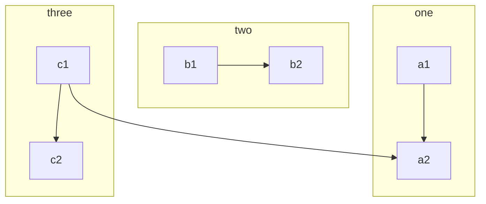
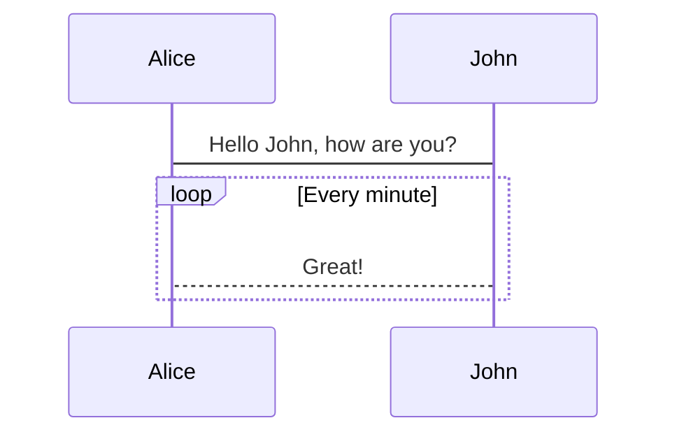
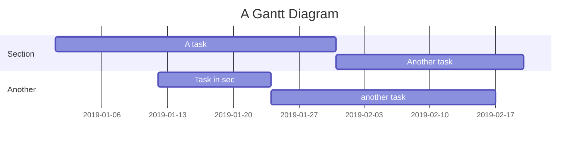

---

title: MarkDown教程

date: 2018-12-19 11:23:10

categories: Other

tag: Other

---


## Guide

这是一篇讲解如何正确使用 **Markdown** 的排版示例，学会这个很有必要，能让你的文章有更佳清晰的排版。

> 引用文本：Markdown is a text formatting syntax inspired

## 语法指导

### 普通内容

这段内容展示了在内容里面一些排版格式，比如：

- **加粗** - `**加粗**`
- *倾斜* - `*倾斜*`
- ~~删除线~~ - `~~删除线~~`
- `Code 标记` - `Code 标记`
- [超级链接](http://github.com) - `[超级链接](http://github.com)`
- [username@gmail.com](mailto:username@gmail.com) - `[username@gmail.com](mailto:username@gmail.com)`

### 提及用户

@Vanessa ... 通过 @ 可以在发帖和回帖里面提及用户，被提及的用户将会收到系统通知，以便让他来关注这个帖子或回帖。

> NOTE:
>
> 1. @用户名之后需要有一个空格
> 2. 新手没有艾特的功能权限

### 表情符号 Emoji

支持大部分标准的表情符号，可使用输入法直接输入，也可手动输入字符格式。通过输入 `:` 触发自动完成，可在个人设置中[设置常用表情](https://hacpai.com/settings/function)。

#### 一些表情例子

:smile: :laughing: :dizzy_face: :sob: :cold_sweat: :sweat_smile:  :cry: :triumph: :heart_eyes: :relieved:
:+1: :-1: :100: :clap: :bell: :gift: :question: :bomb: :heart: :coffee: :cyclone: :bow: :kiss: :pray: :anger:

### 大标题 - Heading 3

你可以选择使用 H1 至 H6，使用 ##(N) 打头。建议帖子或回帖中的顶级标题使用 Heading 3，不要使用 1 或 2，因为 1 是系统站点级，2 是帖子标题级。

> NOTE: 别忘了 # 后面需要有空格！

#### Heading 4

##### Heading 5

###### Heading 6

### 图片

```


```

支持复制粘贴直接上传。

### 代码块

#### 普通

```
*emphasize*    **strong**
_emphasize_    __strong__
var a = 1
```

#### 语法高亮支持

如果在 ``` 后面跟随语言名称，可以有语法高亮的效果哦，比如:

##### 演示 Go 代码高亮

```go
package main

import "fmt"

func main() {
	fmt.Println("Hello, 世界")
}
```

##### 演示 Java 高亮

```java
public class HelloWorld {

    public static void main(String[] args) {
        System.out.println("Hello World!");
    }

}
```

> Tip: 语言名称支持下面这些: `ruby`, `python`, `js`, `html`, `erb`, `css`, `coffee`, `bash`, `json`, `yml`, `xml` ...

### 有序、无序、任务列表

#### 无序列表

- Java
  - Spring
    - IoC
    - AOP
- Go
  - gofmt
  - Wide
- Node.js
  - Koa
  - Express

#### 有序列表

1. Node.js
   1.1. Express
   1.2. Koa
   1.3. Sails
2. Go
   2.1. gofmt
   2.2. Wide
3. Java
   3.1. Latke
   3.2. IDEA

#### 任务列表

- [x] 发布 Sym
- [x] 发布 Solo
- [ ] 预约牙医

### 表格

如果需要展示数据什么的，可以选择使用表格。

| header 1 | header 3 |
| -------- | -------- |
| cell 1   | cell 2   |
| cell 3   | cell 4   |
| cell 5   | cell 6   |

### 隐藏细节

<details>
<summary>Summary</summary>
Details
</details>

### 段落

留空白的换行，将会被自动转换成一个段落，会有一定的段落间距，便于阅读。

请注意后面 Markdown 源代码的换行留空情况。

### 数学公式

$$a^2 + b^2 = \color{red}c^2$$

### 流程图



### 时序图



### 甘特图


