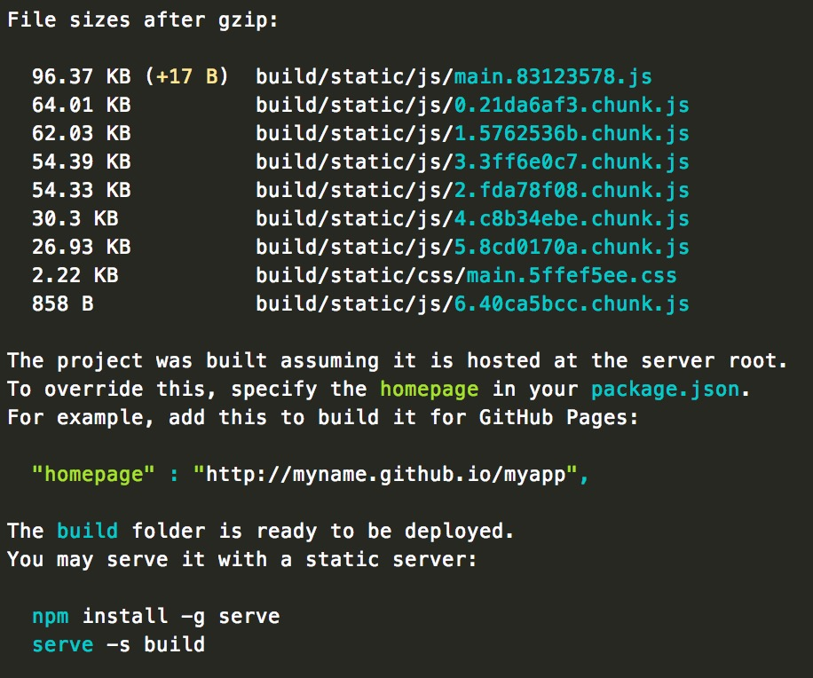
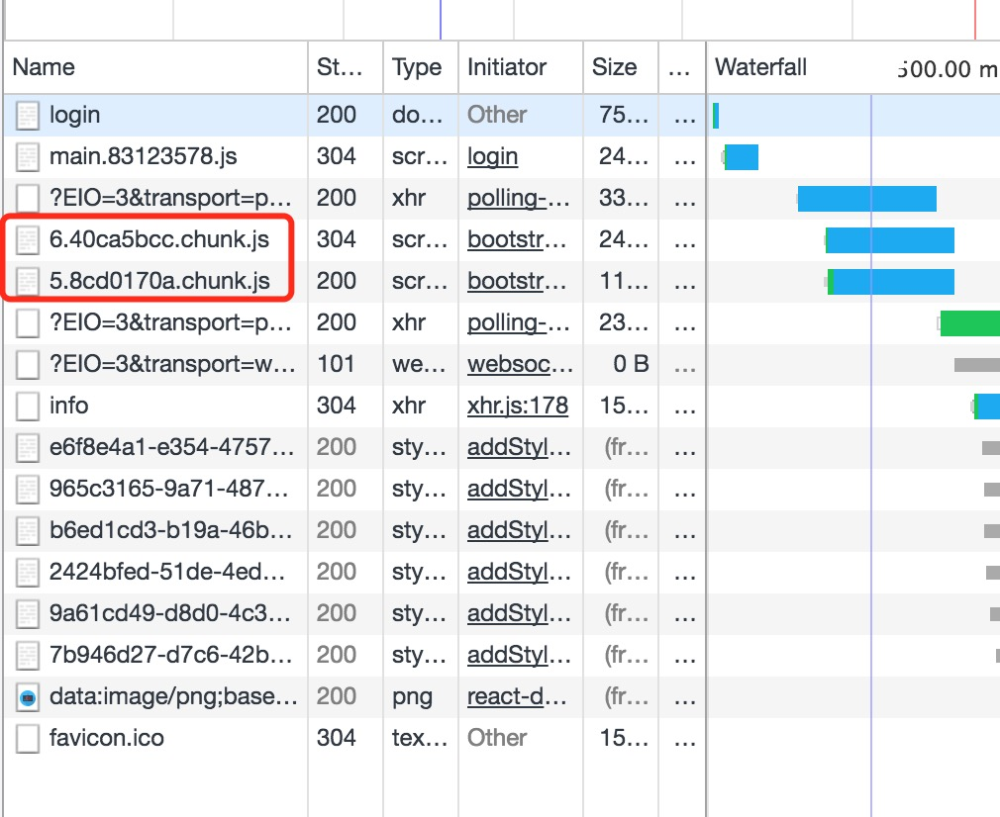

# react实现按需加载-代码分割（下）

### 前言

上节中所使用的`webpack`配置的时候所安装的`react`，可以使用`bundle-loader`来实现按需加载，但是在`create-react-app`中使用会出现报错：

```javascript
Line 4:   Unexpected '!' in 'bundle-loader?lazy&name=login!./container/login/login'. Do not use import syntax to configure webpack loaders                 import/no-webpack-loader-syntax
Line 5:   Unexpected '!' in 'bundle-loader?lazy&name=register!./container/register/register'. Do not use import syntax to configure webpack loaders        import/no-webpack-loader-syntax
```

这是因为create-react-app不支持webpack-loader，具体的可以看看这个[issue](https://github.com/facebookincubator/create-react-app/issues/2477)，在这个issue中给出了解决方案。

### 一、根据router实现按需加载

1.未按需加载前，原文件`router.js`

```javascript
import React from 'react';
import {Route,Switch,Redirect} from 'react-router-dom';
import Login from './container/login/login'
import Register from "./container/register/register";
import Bossinfo from "./container/bossinfo/bossinfo";
import Geniusinfo from "./container/geniusinfo/geniusinfo";
import AuthRoute from "./components/authroute/authroute";
import Dashboard from "./components/dashboard/dashboard";
import Chat from './components/chat/chat';

class App extends React.Component{
    constructor(props){
        super(props);
        this.state = {
            hasError:false
        }
    }

    componentDidCatch(err,info){
            this.setState({
            hasError:true
        })
    }

    render(){
        return(
            this.state.hasError ? <Redirect to='/msg'></Redirect>
                :
            <div>
                <AuthRoute/>
                <Switch>
                    <Route path='/login' component={Login}></Route>
                    <Route path='/register' component={Register}></Route>
                    <Route path='/bossinfo' component={Bossinfo}></Route>
                    <Route path='/geniusinfo' component={Geniusinfo}></Route>
                    <Route path='/chat/:user' component={Chat}></Route>
                    <Route component={Dashboard}></Route>
                </Switch>
            </div>
        )
    }
}
```

2.使用`AsyncComponent.js`，最原始的：

```js
import React, { Component } from 'react'

class Bundle extends Component {
  constructor() {
    super()
    this.state = {
      mod: null
    }
  }

  async componentDidMount() {
    const {default: mod} = await this.props.load()

    this.setState({
      mod: mod.default || mod
    })
  }

  render() {
    return (
      this.state.mod ? this.props.children(this.state.mod) : null
    )
  }
}

export default Bundle
```

然后在入口文件中这么使用：

```js
import React from 'react'
import {
  BrowserRouter,
  Route
} from 'react-router-dom'
import Bundle from './bundle'

let CodeSplit = () => {
  return (
    <BrowserRouter>
      <div>
        <Route path={'/cp1'} render={() => {
          return (<Bundle load={() => import('./cp1')}>
            {(Cp1) => <Cp1></Cp1>}
          </Bundle>)
        }
        }></Route>

        <Route path={'/cp2'} render={() => {
          return (<Bundle load={() => import('./cp2')}>
            {(Cp2) => <Cp2></Cp2>}
          </Bundle>)
        }
        }></Route>
      </div>
    </BrowserRouter>
  )
}


export default CodeSplit
```

这样进行使用太麻烦了，可以进行优化改进，下面是改进的使用方案，让其能够更优雅地进行使用。

3.创建文件`AsyncComponent.js`，因为import返回一个promise，所以我们这里将componentDidMount变成一个async函数

```javascript
import React, { Component } from "react";

export default function asyncComponent(importComponent) {
  class AsyncComponent extends Component {
    constructor(props) {
      super(props);

      this.state = {
        component: null
      };
    }

    async componentDidMount() {
      const { default: component } = await importComponent();

      this.setState({
        component: component
      });
    }

    render() {
      const C = this.state.component;

      return C ? <C {...this.props} /> : null;
    }
  }

  return AsyncComponent;
}
```

4.使用`AsyncComponent`

我们原来导入组件：

```js
import Home from "./containers/Home";
```

现在导入组件：

```Js
const AsyncHome = asyncComponent(() => import("./containers/Home"));
```

当创建`AsyncHome`时，调用的函数`asyncComponent`会动态地`import`组件；然后`Route`使用：

```js
<Route path="/" exact component={AsyncHome} />
```

使用示例：

```js
import asyncComponent from './async-component'

// 获取到异步组件
const AsyncDemo = asyncComponent(() => import('./demo'))

//...
render() {
  return (
    <Route path="/demo" component={AsyncDemo}></Route>
  )
}

// 如果要传参 这样会router中的参数以0下标传入，感觉并不合理，还没找到合理的办法 更合理的办法应该是修改async函数，但是不知道怎么修改 不知道我这理解对不对
render() {
  return (
    <Route path="/demo" render={(...props) => {
        <AsyncDemo test="hello" {...props}></AsyncDemo>
    }}></Route>
  )
}
```

然后修改入口文件就像这样：

```jsx
import React from 'react';
import {Route,Switch,Redirect} from 'react-router-dom';
import asyncComponent from './Bundle'
const Login = asyncComponent(() => import("./container/login/login"));
const Register = asyncComponent(() => import("./container/register/register"));
const Bossinfo = asyncComponent(() => import("./container/bossinfo/bossinfo"));
const Geniusinfo = asyncComponent(() => import("./container/geniusinfo/geniusinfo"));
const AuthRoute = asyncComponent(() => import("./components/authroute/authroute"));
const Dashboard = asyncComponent(() => import("./components/dashboard/dashboard"));
const Chat = asyncComponent(() => import("./components/chat/chat"));


class App extends React.Component{
    constructor(props){
        super(props);
        this.state = {
            hasError:false
        }
    }

    componentDidCatch(err,info){
        console.log(err,info);
        this.setState({
            hasError:true
        })
    }

    render(){
        return(
            this.state.hasError ? <Redirect to='/msg'></Redirect>
                :
            <div>
                <AuthRoute/>
                <Switch>
                    <Route path='/login' component={Login}></Route>
                    <Route path='/register' component={Register}></Route>
                    <Route path='/bossinfo' component={Bossinfo}></Route>
                    <Route path='/geniusinfo' component={Geniusinfo}></Route>
                    <Route path='/chat/:user' component={Chat}></Route>
                    <Route component={Dashboard}></Route>
                </Switch>
            </div>
        )
    }
}

export default App;
```

执行`npm run build`可看到文件被`code-spliting`





###二、以组件为中心进行代码分片

待续···


