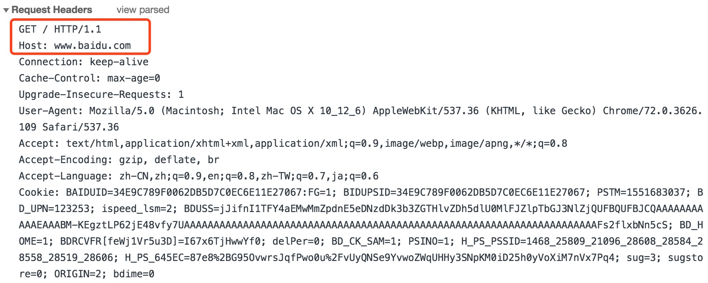
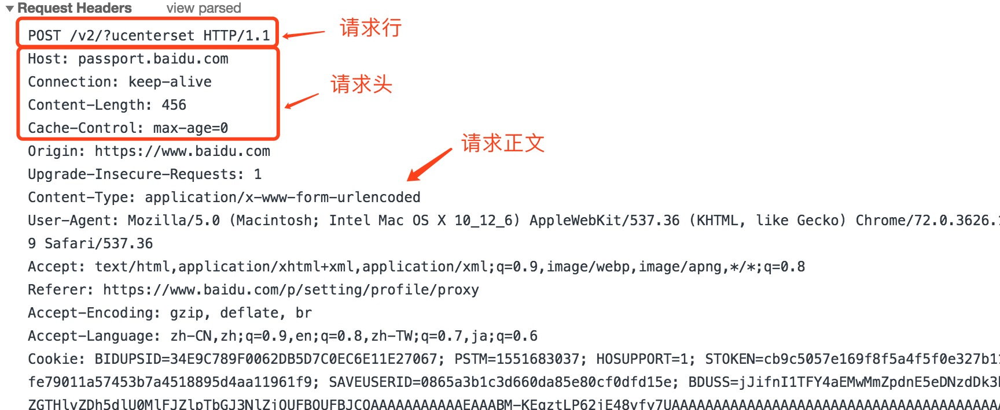

# HTTP协议详解

## 引言

HTTP是一个属于应用层的面向对象的协议，由于其简洁、快速的方式，适用于分布式超媒体信息系统。它的全称是Hyper Text Transfer Protocol（超文本传输协议），是一种建立在TCP上的无状态连接。

HTTP请求的流程是，客户端发送一个`HTTP`请求，说明客户端想要访问的资源和请求的动作，服务端接收到请求之后，服务端开始处理请求，并根据请求做出相应的动作访问服务器资源，最后通过发送`HTTP`响应把结果返回给客户端。

其中，一个请求的开始到一个响应的结束称为事务，当一个事务结束后还会在服务端添加一条日志条目。

## 特点

HTTP的特点可概括如下：

1. 支持客户端/服务器模式
2. 简单快速：客户端向服务器请求数据时，只需传送请求方法和路径。请求方法常用的有`GET`、`POST`、`PUT`、`DELETE`、`HEAD`。每种方法规定了客户端与服务器联系的类型不同。由于`HTTP`协议简单，使得`HTTP`服务器的程序规模小，因而通信速度很快。
3. 灵活：`HTTP`允许传输任意类型的对象。正在传输的类型由`Content-Type`加以标记。
4. 无连接：含义是限制每次连接只处理一个请求。服务器处理完客户的请求，并受到客户的应答后，即断开链接。采用这种方式可以节省传输时间。
5. 无状态：`HTTP`是无状态协议。无状态协议是指协议对于事务处理没有记忆能力。缺少状态意味着如果后续处理需要前面的信息，则它必须重传，这样可能导致每次链接传送的数据量增大。另一方面，在服务器不需要先前信息时它的应答就较快。

### HTTP之URL篇

HTTP是一个基于请求与响应模式的、无状态的、应用层的协议，常基于TCP的连接方式，绝大多数的`Web`开发，都是构建在`HTTP`协议上的`Web`应用。

`HTTP URL`的格式如下：

```shell
http://host[":"port][abs_path]
```

`http`表示要通过`HTTP`协议来定位网络资源；`host`表示合法的`Inernet`主机域名或者`IP`地址；`port`指定一个端口号，为空则使用默认端口`80`；`abs_path`指定请求资源的`URI`；如果`URL`中没有给出`abs_path`，那么它作为请求`URI`时，必须以`/`的形式给出，通常这个工作浏览器自动帮我们完成。如：输入`www.test.com`，浏览器会自动转换成`http://www.test.com/`

注：`URL`是一中特殊类型的`URI`，包含了用于查找某个资源的足够的信息。

## HTTP之请求篇

HTTP请求是客户端往服务端发送请求动作，告知服务器自己的要求。

HTTP请求由三部分组成，分别是：请求行、消息报头、请求正文。

这里先介绍请求行，消息报头及请求正文后述。

请求行包括请求方式Method、资源路径URL、协议版本Version；

请求行以一个方法符号开头，以空格分开，后面跟着请求的URI和协议的版本，格式如下：

```shell
Method Request-URI HTTP-Version CRLF  
```

其中`Method`表示请求方法；`Request-URI`是一个统一资源标识符；`HTTP-Version`表示请求的`HTTP`协议版本；`CRLF`表示回撤和换行（除了作为结尾的`CRLF`外，不允许出现单独的`CR`或`LF`字符）。

请求方法有多种：

* `GET`：请求获取`Request-URI`所标识的资源
* `POST`：在`Request-URI`所标识的资源后附加新的数据
* `HEAD`：请求获取由`Request-URI`所标识的资源的响应消息报头
* `PUT`：请求服务器存出一个资源，并用`Request-URI`作为其标识
* `DELETE`：请求服务器删除`Request-URI`所标识的资源
* `TRACE`：请求服务器回送收到的请求信息，主要用于测试或诊断
* `CONNECT`：保留将来使用
* `OPTIONS`：请求查询服务器性能，或者查询与资源相关的选项和需求

应用举例：

1. `GET`方法：在浏览器的地址栏中输入网址的方式访问网页时，浏览器采用GET方法向服务器获取资源。

   ```javascript
   GET /form.html HTTP/1.1 (CRLF)
   ```

   

2. `POST`方法：要求被请求服务器接受附在请求后面的数据，常用于提交表单。

   ```javascript
   POST /reg.jsp HTTP/ (CRLF)
   Accept:image/gif,image/x-xbit,... (CRLF)
   ...
   HOST:www.guet.edu.cn (CRLF)
   Content-Length:22 (CRLF)
   Connection:Keep-Alive (CRLF)
   Cache-Control:no-cache (CRLF)
   (CRLF)  // 该CRLF表示消息报头已经结束，在此之前为消息报头
   user=jeffrey&pwd=1234  // 此行以下为提交的数据
   ```

   

3. `HEAD`方法与`GET`方法几乎是一样的，对于`HEAD`请求的回应部分来说，它的`HTTP`头部中包含的信息与通过`GET`请求所得到的信息是相同的。利用这个方法，不必传输整个资源内容，就可以得到`Request-URI`所标识的资源的信息。该方法常用于测试超链接的有效性，是否可以访问，以及最近是否更新。

### 消息报头

## HTTP之响应篇

在接收和解释请求报文后，服务器返回一个`HTTP`响应消息。

HTTP响应也是由三个部分组成，分别是：状态行、消息报头、响应正文。

只介绍状态行，消息报头和响应正文后述。

状态行格式如下：

```javascript
HTTP-Version Status-Code Reason-Phrase CRLF
```

其中，`HTTP-Version`表示服务器`HTTP`协议版本；`Status-Code`表示服务器发回的响应状态代码；`Reason-Phrase`表示状态代码的文本描述。

状态代码由三位数字组成，第一个数字定义了响应的**类别**，且有五种可能取值：

1. `1XX`：指示信息，表示请求已接收，继续处理
2. `2XX`：成功--表示请求已被成功接收、理解、接受
3. `3XX`：重定向--要完成请求必须进行更进一步的操作
4. `4XX`：客户端错误—请求有语法错误或请求无法实现
5. `5XX`：服务器端错误—服务器未能实现合法的请求，服务器在处理请求过程中发生了错误

常见的状态代码、状态描述和说明：

| 状态码 | 状态描述                      | 说明                                                         |
| ------ | ----------------------------- | ------------------------------------------------------------ |
| 200    | OK                            | 客户端请求成功                                               |
|        |                               |                                                              |
| 203    | Non-Authoritative Information | 非授权信息。请求成功。但返回的meta信息不在原始的服务器，而是一个副本 |
| 301    | Moved Permanently             | 请求永久重定向。 请求的资源已被永久的移动到新URI，返回信息会包括新的URI，浏览器会自动定向到新URI。今后任何新的请求都应使用新的URI代替 |
| 302    | Found                         | 请求临时重定向。与301类似，但资源只是临时被移动。客户端应继续使用原有URI |
| 304    | Not Modified                  | 请求被重定向到客户端本地缓存                                 |
| 400    | Bad Request                   | 明显客户端错误（如：语法错误、太大的大小、无效请求消息或欺骗性路由） |
| 401    | Unauthorized                  | 客户端请求未经授权                                           |
| 403    | Forbidden                     | 服务器已经理解请求，但是拒绝执行它                           |
| 404    | Not Found                     | 请求资源不存在， 但允许用户的后续请求                        |
| 500    | Internal Server Error         | 服务器发生不可预期的错误                                     |
| 502    | Bad Gateway                   | 作为网关或者代理工作的服务器尝试执行请求时，从远程服务器接收到了一个无效的响应 |
| 503    | Service Unavailable           | 服务端发生临时错误。 服务器当前不能处理客户端的请求，一段时间后可能恢复正常 |

注：状态码详情介绍可查阅[维基百科](https://zh.wikipedia.org/wiki/HTTP%E7%8A%B6%E6%80%81%E7%A0%81)

## HTTP之消息报头篇

HTTP消息由客户端到服务器的请求和服务器到客户端的响应组成。请求消息和响应消息都是由开始行（对于请求消息，开始行就是请求行，对于响应消息，开始行就是状态行），消息报头（可选），空行（只有CRLF的行），消息正文（可选）组成。

HTTP消息报头包括：普通报头、请求报头、响应报头、实体报头。

每一个报头域都是由**名字+“：”+空格+值**组成，消息报头域的名字是大小写无关的。

### 1.普通报头

在普通报头中，有少数报头域用于所有的请求和响应消息，但并不用于被传输的实体，只用于传输的消息。

eg:

`Cache-Control`   用于指定缓存指令，缓存指令是单向的（响应中出现的缓存指令在请求中未必会出现），且是独立的（一个消息的缓存指令不会影响另一个消息处理的缓存机制）。 请求时的缓存指令包括：no-cache（用于指示请求或响应消息不能缓存）、no-store、max-age、max-stale、min-fresh、only-if-cached; 响应时的缓存指令包括：public、private、no-cache、no-store、no-transform、must-revalidate、proxy-revalidate、max-age、s-maxage。

`Date`普通报头域表示消息产生的日期和时间。

`Connection`普通报头域允许发送指定连接的选项。例如指定连接是连续，或者指定“close”选项，通知服务器，在响应完成后，关闭连接。

### 2.请求报头

请求报头允许客户端想服务器传递请求的附加信息以及客户端自身的信息。

常用的请求报头：

**1. Accept**

`Accept`请求报头域用于指定客户端接收哪些类型的信息。

eg：`Accept-Charset:iso-8859-1,gb2312`.如果在请求消息中没有设置这个域，缺省是任何字符集都可以接受。

**2. Accept-Encoding**

`Accept-Encoding`请求报头域类似于Accept，但是它是用于指定可接受的内容编码。

eg：`Accept-Encoding:gzip.deflate`。如果请求消息中没有设置这个域服务器假定客户端对各种内容编码都可以接受。

**3. Accept-Language**

`Accept-Language`请求报头域类似于`Accept`，但是它是用于指定一种自然语言。

eg：`Accept-Language:zh-cn`。如果请求消息中没有设置这个报头域，服务器假定客户端对各种语言都可以接受。

**4. Authorization**

`Authorization`请求报头域主要用于证明客户端有权查看某个资源。当浏览器访问一个页面时，如果收到服务器的响应代码为401（未授权），可以发送一个包含`Authorization`请求报头域的请求，要求服务器对其进行验证。

**5.Host **

`Host`请求报头域主要用于指定被请求资源的Internet主机和端口号，它通常从`HTTP URL`中提取出来的，在发送请求时，该报头域是必须的。

eg： 我们在浏览器中输入：`http://www.test.com/form.html` 浏览器发送的请求消息中，就会包含`Host`请求报头域，如下：` Host：www.test.com` 此处使用缺省端口号80，若指定了端口号如9527，则变成：` Host：www.test.com:9527`

**6.User-Agent **

我们上网登陆论坛的时候，往往会看到一些欢迎信息，其中列出了你的操作系统的名称和版本，你所使用的浏览器的名称和版本，实际上，服务器应用程序就是从`User-Agent`这个请求报头域中获取到这些信息。`User-Agent`请求报头域允许客户端将它的操作系统、浏览器和其它属性告诉服务器。不过，这个报头域不是必需的。

---

请求报头的例子：

```shell
GET /form.html HTTP/1.1 (CRLF)
Accept:image/gif,image/x-xbitmap,image/jpeg,application/x-shockwave-flash,application/vnd.ms-excel,application/vnd.ms-powerpoint,application/msword,*/* (CRLF)
Accept-Language: zh-cn (CRLF)
Accept-Encoding: gzip,deflate (CRLF)
If-Modified-Since: Wed,05 Jan 2007 11:21:25 GMT (CRLF)
If-None-Match: W/"80b1a4c018f3c41:8317" (CRLF)
User-Agent: Mozilla/4.0(compatible;MSIE6.0;Windows NT 5.0) (CRLF)
Host: www.test.com (CRLF)
Connection: Keep-Alive (CRLF)
(CRLF)
```

### 3.响应报头

响应报头允许服务器传递不能放在状态行中的附加响应信息，以及关于服务器的信息和对`Request-URI`所标识的资源进行下一步访问的信息。 

常用的响应报头

**1. Location**

`Location`响应报头域用于重定向接受者到一个新的位置。`Location`响应报头域常用在更换域名的时候。

**2. Server**

Server响应报头域包含了服务器用来处理请求的软件信息。与User-Agent请求报头域是相对应的。

eg: `Server: Apache `

**3. WWW-Authenticate**

`WWW-Authenticate`响应报头域必须被包含在`401`（未授权的）响应消息中，客户端收到`401`响应消息时候，并发送`Authorization`报头域请求服务器对其进行验证时，服务端响应报头就包含该报头域。

eg：`WWW-Authenticate:Basic realm="Basic Auth Test!" ` ，可以看出服务器对请求资源采用的是基本验证机制。

### 4.实体报头

请求和响应消息都可以传送一个实体。一个实体由实体报头域和实体正文组成，但并不是说实体报头域和实体正文要在一起发送，可以只发送实体报头域。实体报头定义了关于实体正文（eg：有无实体正文）和请求所标识的资源的元信息。

常用的实体报头

**1. Content-Type**

`Content-Type`实体报头域用语指明发送给接收者的实体正文的媒体类型。

eg： 

```shell
Content-Type:text/html;charset=ISO-8859-1 
// or
Content-Type:text/html;charset=GB2312
```

**2. Content-Encoding**

`Content-Encoding`实体报头域被用作媒体类型的修饰符，它的值指示了已经被应用到实体正文的附加内容的编码，因而要获得`Content-Type`报头域中所引用的媒体类型，必须采用相应的解码机制。

eg：`Content-Encoding：gzip`，Content-Encoding这样用于记录文档的压缩方法。

**3. Content-Language**

`Content-Language`实体报头域描述了资源所用的自然语言。没有设置该域则认为实体内容将提供给所有的语言阅读 者。

eg：`Content-Language:zh-cn  `

**4. Content-Length**

`Content-Length`实体报头域用于指明实体正文的长度，以字节方式存储的十进制数字来表示。

**5. Last-Modified**

`Last-Modified`实体报头域用于指示资源的最后修改日期和时间。

**6. Expires**

Expires实体报头域给出响应过期的日期和时间。为了让代理服务器或浏览器在一段时间以后更新缓存中的页面，可以使用`Expires`实体报头域指定页面过期的时间。

eg：`Expires：Thu，15 Sep 2006 16:23:12 GMT`

```shell
~ andy$ curl -v www.baidu.com
* Rebuilt URL to: www.baidu.com/
*   Trying 115.239.210.27...
* TCP_NODELAY set
* Connected to www.baidu.com (115.239.210.27) port 80 (#0)
> GET / HTTP/1.1
> Host: www.baidu.com
> User-Agent: curl/7.54.0
> Accept: */*
> 
< HTTP/1.1 200 OK
< Accept-Ranges: bytes
< Cache-Control: private, no-cache, no-store, proxy-revalidate, no-transform
< Connection: Keep-Alive
< Content-Length: 2381
< Content-Type: text/html
< Date: Wed, 06 Mar 2019 03:43:52 GMT
< Etag: "588604fc-94d"
< Last-Modified: Mon, 23 Jan 2017 13:28:28 GMT
< Pragma: no-cache
< Server: bfe/1.0.8.18
< Set-Cookie: BDORZ=27315; max-age=86400; domain=.baidu.com; path=/
< 
<!DOCTYPE html>
···
```

## HTTP协议版本更替

**HTTP/0.9**

HTTP协议的最初版本，功能简陋，仅支持请求方式`GET`，并且仅能请求访问`HTML`格式的资源。

**HTTP/1.0** 

在0.9版本上做了进步，增加了请求方式`POST`和`HEAD`；不再局限于0.9版本的HTML格式，根据`Content-Type`可以支持多种数据格式，即MIME多用途互联网邮件扩展，例如text/html、image/jpeg等；同时也开始支持cache，就是当客户端在规定时间内访问统一网站，直接访问cache即可。

但是1.0版本的工作方式是每次`TCP`连接只能发送一个请求，当服务器响应后就会关闭这次连接，下一个请求需要再次建立`TCP`连接，就是不支持`keepalive`。

**HTTP/1.1**    

解决了1.0版本的`keepalive`问题，1.1版本加入了持久连接，一个`TCP`连接可以允许多个`HTTP`请求； 加入了管道机制，一个TCP连接同时允许多个请求同时发送，增加了并发性；新增了请求方式`PUT`、`PATCH`、`DELETE`等。

但是还存在一些问题，服务端是按队列顺序处理请求的，假如一个请求处理时间很长，则会导致后边的请求无法处理，这样就造成了队头阻塞的问题；同时HTTP是无状态的连接，因此每次请求都需要添加重复的字段，降低了带宽的利用率。

**HTTP/2.0**

为了解决1.1版本利用率不高的问题，提出了HTTP/2.0版本。增加双工模式，即不仅客户端能够同时发送多个请求，服务端也能同时处理多个请求，解决了队头堵塞的问题；HTTP请求和响应中，状态行和请求/响应头都是些信息字段，并没有真正的数据，因此在2.0版本中将所有的信息字段建立一张表，为表中的每个字段建立索引，客户端和服务端共同使用这个表，他们之间就以索引号来表示信息字段，这样就避免了1.0旧版本的重复繁琐的字段，并以压缩的方式传输，提高利用率。

另外也增加服务器推送的功能，即不经请求服务端主动向客户端发送数据。

注：当前主流的协议版本还是HTTP/1.1版本

## 其他补充

### 基础

1. 高级协议有：文件传输协议FTP、电子邮件传输协议SMTP、域名系统服务DNS、网络新闻传输协议NNTP和HTTP协议等。
2. 中介有三种：代理（Proxy）、网关（Gateway）和通道（Tunnel），一个代理根据`URI`的绝对格式来接收请求，重写全部或部分信息，通过`URI`的标识把已格式化过的请求发送到服务器。网关是一个接收代理，作为一些其他服务器的上层，并且如果必须的话，可以把请求翻译给下层的服务器协议。一个通道作为不改变消息的两个连接之间的中继点。当通讯需要通过一个中介（如：防火墙）或者是中介不能识别消息的内容时，通道经常被使用。
3. 代理（Proxy）：一个中间程序，它可以充当一个服务器，也可以充当一个客户机，为其它客户机建立请求。请求时通过可能的在内部翻译或经过传递到其他的服务器中。一个代理在发送请求信息之前，必须解释并且如果可能重写它。代理经常作为通过防火墙的客户端门户，代理还可以作为一个帮助应用来通过协议处理没有被用户代理完成的请求。
4. 网关（Gateway）：一个作为其他服务器中间媒介的服务器。与代理不同的是，网关接受请求就好像对被请求的资源来说它就是源服务器；发出请求的客户机并没有意识到它在同网关打交道。网关经常作为通过防火墙的服务器端的门户，网关还可以作为一个协议翻译器以便存取哪些存储在非HTTP系统中的资源。
5. 通道（Tunnel）：是作为两个连接中继的中介程序。一旦激活，通道便认为不属于HTTP通讯，尽管通道可能是被一个HTTP请求初始化的。当被中继的连接两端关闭时，通道便消失。当一个门户(Portal)必须存在或中介(Intermediary)不能解释中继的通讯时通道被经常使用。

### 123

**协议分析的优势—HTTP分析器检测网络攻击** 

以模块化的方式对高层协议进行分析处理，将是未来入侵检测的方向。 HTTP及其代理的常用端口80、3128和8080在network部分用port标签进行了规定 

**HTTP协议Content Lenth限制漏洞导致拒绝服务攻击**

 使用POST方法时，可以设置ContentLenth来定义需要传送的数据长度，例如ContentLenth:999999999，在传送完成前，内 存不会释放，攻击者可以利用这个缺陷，连续向WEB服务器发送垃圾数据直至WEB服务器内存耗尽。这种攻击方法基本不会留下痕迹。

**利用HTTP协议的特性进行拒绝服务攻击的一些构思**

 服务器端忙于处理攻击者伪造的TCP连接请求而无暇理睬客户的正常请求（毕竟客户端的正常请求比率非常之小），此时从正常客户的角度看来，服务器失去响应，这种情况我们称作：服务器端受到了SYNFlood攻击（SYN洪水攻击）。 

而Smurf、TearDrop等是利用ICMP报文来Flood和IP碎片攻击的。本文用“正常连接”的方法来产生拒绝服务攻击。 

19端口在早期已经有人用来做Chargen攻击了，即Chargen_Denial_of_Service，但是！他们用的方法是在两台Chargen 服务器之间产生UDP连接，让服务器处理过多信息而DOWN掉，那么，干掉一台WEB服务器的条件就必须有2个：1.有Chargen服务；2.有HTTP服务 

方法：攻击者伪造源IP给N台Chargen发送连接请求（Connect），Chargen接收到连接后就会返回每秒72字节的字符流（实际上根据网络实际情况，这个速度更快）给服务器。 

**Http指纹识别技术**

Http指纹识别的原理大致上也是相同的：记录不同服务器对Http协议执行中的微小差别进行识别.Http指纹识别比TCP/IP堆栈指纹识别复杂许 多,理由是定制Http服务器的配置文件、增加插件或组件使得更改Http的响应信息变的很容易,这样使得识别变的困难；然而定制TCP/IP堆栈的行为 需要对核心层进行修改,所以就容易识别。    

要让服务器返回不同的Banner信息的设置是很简单的,象Apache这样的开放源代码的Http服务器,用户可以在源代码里修改Banner信息,然 后重起Http服务就生效了；对于没有公开源代码的Http服务器比如微软的IIS或者是Netscape,可以在存放Banner信息的Dll文件中修 改,相关的文章有讨论的,这里不再赘述,当然这样的修改的效果还是不错的.另外一种模糊Banner信息的方法是使用插件。

 常用测试请求：

1. HEAD/Http/1.0发送基本的Http请求 
2. DELETE/Http/1.0发送那些不被允许的请求,比如Delete请求
3. GET/Http/3.0发送一个非法版本的Http协议请求 
4. GET/JUNK/1.0发送一个不正确规格的Http协议请求 

Http指纹识别工具Httprint,它通过运用统计学原理,组合模糊的逻辑学技术,能很有效的确定Http服务器的类型.它可以被用来收集和分析不同Http服务器产生的签名。 

 **其他**

为了提高用户使用浏览器时的性能，现代浏览器还支持并发的访问方式，浏览一个网页时同时建立多个连接，以迅速获得一个网页上的多个图标，这样能更快速完成整个网页的传输。 HTTP1.1中提供了这种持续连接的方式，而下一代HTTP协议：HTTP-NG更增加了有关会话控制、丰富的内容协商等方式的支持，来提供更高效率的连接。