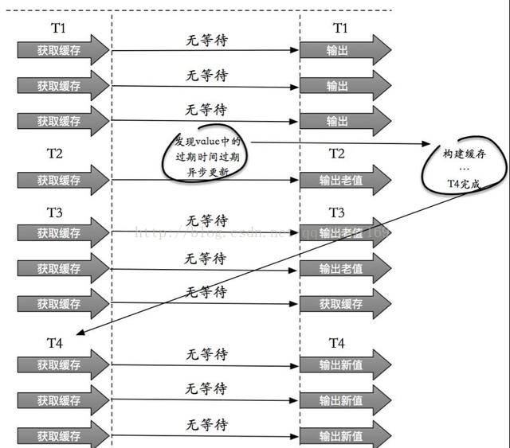

# Redis知识点总结

1. Redis的全称是Remote Dictionary Server，本质上是一个`key-value`类型的内存数据库，它支持的`value`类型有字符串`String`、哈希`Hash`、无序集合`Set`、有序集合`Sorted Set`、列表`List`。这些数据类型都支持push/pop、add/remove、取交集并集差集以及更丰富的操作，而且这些操作类型都是原子性的。与memcached类似，将数据都加载至内存中进行操作，不同之处在于redis会周期性地将更新数据写入到磁盘中。

2. Redis支持的数据类型

   * String：用于管理redis字符串值；string类型是二进制安全的。意思是redis的string可以包含任何数据。比如jpg图片或者序列化的对象 。`set key value`、`get key value`
   * Hash：是一个`String`类型的`field`和`value`的映射表，适合用于存储对象，每个`hash`可存储2^32-1个键值对；`HMSET hashkey key1 value1 key2 value2 ...`、`HGETALL hashkey`
   * List：列表是一个简单的字符串列表，按照插入顺序进行排序，可以添加一个元素到列表的头部或者尾部；`lpush listkey  value`、`rpush  listkey  value`、`lpop listkey`、`rpop listkey`
   * Set：是 String 类型的无序集合，集合成员是唯一的，这就意味着集合中不能出现重复的数据，集合是通过哈希表实现的，所以添加，删除，查找的复杂度都是 O(1)。`SADD key member1 [member2]`、`SMEMBERS key`
   * zSet：有序集合和集合一样也是string类型元素的集合,且不允许重复的成员；不同的是每个元素都会关联一个double类型的分数。redis正是通过分数来为集合中的成员进行从小到大的排序。集合是通过哈希表实现的，所以添加，删除，查找的复杂度都是O(1)。

3. Redis持久化的含义，Redis持久化的方式以及优缺点：

   ​	Redis持久化就是把内存中的数据写入到磁盘中，防止服务器宕机时数据丢失。

   Redis持久化支持两种方式：RDB（默认）和AOF

   * RDB：是`Redis Database`的缩写，在指定的时间间隔对数据进行快照存储。

     功能核心函数是`rdbSave()`和`rdbLoad()`

     

     **优点：**

     1. RDB数据非常紧凑，它保存了某个时间点的数据集，非常适用于数据集的备份；
     2. RDB是个紧凑单一的文件，非常适用于数据的灾难恢复
     3. RDB在保存RDB文件时父进程唯一需要做的就是fork出一个子进程，接下来的工作全部由子进程来做，父进程不需要再做其他IO操作，所以RDB持久化方式可以最大化redis的性能
     4. 与AOF相比，在恢复大数据的时候，RDB方式更快一些

     **缺点：**

     * 如果希望Redis在意外停止工作时损失数据最少的话，RDB不合适，它要保存一个完整的数据集是一个比较繁重的工作
     * RDB需要经常fork子进程来保存数据到硬盘上，当数据集比较大时，fork过程是非常耗时的，可能会导致Redis在一些毫秒级内不能响应客户端的请求。如果数据集巨大并且CPU性能不是很好的情况下,这种情况会持续1秒，AOF也需要fork，但是可以调节重写日志文件的频率来提高数据集的耐久度

   * AOF是`Append-only file`的缩写

     AOF持久化方式是记录每次对服务器的写操作；Redis重启的时候优先载入AOF文件对数据进行恢复，通常情况下，AOF保存的数据集要比RDB保存的完整。

     

     **优点：**

     * 使用AOF会让Redis数据更加耐久，可以使用不容的`fsync`策略进行AOF操作，无fsync、每秒fsync、每次写操作时fsync
     * Redis文件是一个只进行追加的日志文件，所以不需要写入seek（？？？）
     * AOF文件有序地保存了对数据库的所有写入操作，存储结构是Redis通讯协议RESP的命令文本存储，导入导出方便。

     **缺点：**

     * 对于相同的数据集来说，AOF文件体积通常大于RDB文件体积
     * 根据所使用的fsync策略，AOF速度可能会慢于RDB

     RDB和AOF的使用，建议同时使用两种持久化功能。

     每当服务器执行（定时）任务或调用`flushAppendOnlyFile()`时都会调用AOF，此时AOF会做写入和保存两个操作：

     * WRITE：根据条件，将`aof_buf`的缓存写入到AOF文件；
     * SAVE：根据条件，调用`fsync()`或`fdatasync()`函数，将AOF文件保存到磁盘中。

4. RESP的解释：RESP是Redis客户端和服务端之间采取的一种名为RESP(Redis Serialization Protocol)的序列化协议。

   它的特点是：容易实现、解析快、可读性高。

   RESP主要包含的几种数据类型是：单行回复（简单字符串）、整数、数组、错误信息、多行字符串。Redis客户端向服务端发送一组由执行命令组成的字符串数组，服务端根据不同的命令回复不同类型的数据，但协议的每部分都是以"\r\n"(CRLF)结尾的。？？？另外 RESP 是二进制安全的，不需要处理从一个进程到另一个进程的传输，因为它使用了前缀长度进行传输。

   在RESP中，一些数据的类型通过第一个字节进行判断：

   * 单行回复：回复的第一个字节是“+”
   * 整数：回复的第一个字节是“:”
   * 错误信息：回复的第一个字节是“-”
   * 数组：回复的第一个字节是“*”
   * 多行字符串：回复的第一个字节是 “\$”

5. 达到Redis使用上限：如果达到设置的上限，Redis的写命令会返回错误信息（但是读命令还可以正常返回。）或者你可以将Redis当缓存来使用配置淘汰机制，当Redis达到内存上限时会冲刷掉旧的内容。

6. Redis的数据淘汰策略：

   * noeviction:返回错误当内存限制达到，并且客户端尝试执行会让更多内存被使用的命令。
   * allkeys-lru: 尝试回收最少使用的键（LRU），使得新添加的数据有空间存放。
   * volatile-lru: 尝试回收最少使用的键（LRU），但仅限于在过期集合的键,使得新添加的数据有空间存放。
   * allkeys-random: 回收随机的键使得新添加的数据有空间存放。
   * volatile-random: 回收随机的键使得新添加的数据有空间存放，但仅限于在过期集合的键。
   * volatile-ttl: 回收在过期集合的键，并且优先回收存活时间（TTL）较短的键,使得新添加的数据有空间存放。

7. 缓存穿透：一般的缓存系统，都是按照key去缓存查询，如果不存在对应的value，就应该去后端系统查找（比如DB）。一些恶意的请求会故意查询不存在的key，请求量很大，每次查询都要到数据库进行查询，就会对后端系统造成很大的压力，这就叫做缓存穿透。

   避免方法：

   1）对查询为空的情况下也进行缓存，缓存时间设置的短一些，或者该key对应的数据插入了数据库之后再清楚缓存；

   2）对一定不存的key进行过滤，可以把所有的可能存在的key放到一个足够大的Bitmap中，查询时通过该bitmap过滤。

8. 缓存雪崩：当缓存服务器重启或者大量缓存集中在某一个时间段失效，发生大量的缓存穿透，会给后端系统带来很大压力。导致系统崩溃。

   避免方法：

   * 加锁排队：通过加锁或者队列来控制读数据库写缓存的线程数量。比如对某个key只允许一个线程查询数据和写缓存，其他线程等待。业界比较常用的做法，是使用mutex。简单地来说，就是在缓存失效的时候（判断拿出来的值为空），不是立即去load db，而是先使用缓存工具的某些带成功操作返回值的操作（比如[Redis](http://lib.csdn.net/base/redis)的SETNX或者Memcache的ADD）去set一个mutex key，当操作返回成功时，再进行load db的操作并回设缓存；否则，就重试整个get缓存的方法。

   * 数据预热： 可以通过缓存reload机制，预先去更新缓存，再即将发生大并发访问前手动触发加载缓存不同的key。

   * 做二级缓存，A1为原始缓存，A2为拷贝缓存，A1失效时，可以访问A2，A1缓存失效时间设置为短期，A2设置为长期

   * key设置不同的过期时间，让缓存失效的时间点尽量均匀

   * 缓存永不过期：包含两层含义，(1) 从缓存上看，确实没有设置过期时间，这就保证了，不会出现热点key过期问题，也就是“物理”不过期。 (2) 从功能上看，如果不过期，那不就成静态的了吗？所以我们把过期时间存在key对应的value里，如果发现要过期了，通过一个后台的异步线程进行缓存的构建，也就是“逻辑”过期。

     从实战看，这种方法对于性能非常友好，唯一不足的就是构建缓存时候，其余线程(非构建缓存的线程)可能访问的是老数据，但是对于一般的互联网功能来说这个还是可以忍受。

     

9. Redis的适用场景：

   1. 会话缓存
   2. 页面缓存
   3. 队列
   4. 排行榜/计数器
   5. 发布/订阅

10. Redis分布式锁：先拿setnx来争抢锁，抢到之后，再用expire给锁加一个过期时间防止锁忘记了释放。如果在setnx之后执行expire之前进程意外crash或者要重启维护了，那会怎么样？set指令有非常复杂的参数，这个应该是可以同时把setnx和expire合成一条指令来用的！

11. Redis异步队列：一般使用list结构作为队列，rpush生产消息，lpop消费消息。当lpop没有消息的时候，要适当sleep一会再重试。

    缺点：

    在消费者下线的情况下，生产的消息会丢失，得使用专业的消息队列如rabbitmq等。

    **能不能生产一次消费多次呢？**

    使用pub/sub主题订阅者模式，可以实现1:N的消息队列。

12. Redis哈希槽：Redis集群没有使用一致性hash,而是引入了哈希槽的概念，Redis集群有16384个哈希槽，每个key通过CRC16校验后对16384取模来决定放置哪个槽，集群的每个节点负责一部分hash槽。

13. Redis管道：一次请求/响应服务器能实现处理新的请求即使旧的请求还未被响应，这样就可以将多个命令发送到服务器，而不用等待回复，最后在一个步骤中读取该答复。

14. Redis回收工作：

15. 理解Redis事务：事务是一个单独的隔离操作，事务中的所有命令都会序列化、按顺序地执行。事务在执行的过程中，不会被其他客户端发送来的命令请求所打断。

    Redis事务可以一次执行多个命令，并且事务有以下保证：

    * 批量操作在执行MULTI之后和执行EXEC之前会被放入队列缓存
    * 收到EXEC命令后进入事务执行，事务中任意命令执行失败，其余的命令依然被执行
    * 事务执行过程中，其他客户端提交的命令请求不会插入到事务执行命令序列中

    事务执行都会经过三个阶段：1.开始事务；2.命令入队；3.执行事务。

    单个 Redis 命令的执行是原子性的，但 Redis 没有在事务上增加任何维持原子性的机制，所以 Redis 事务的执行并不是原子性的。事务可以理解为一个打包的批量执行脚本，但批量指令并非原子化的操作，中间某条指令的失败不会导致前面已做指令的回滚，也不会造成后续的指令不做。

16. Redis架构模式以及特点：

    1.**单机版：**

    

    ​	特点：简单

    ​	问题：1.内存容量有限； 2.处理能力有限 ；3.无法高可用。

    **2.主从复制：**

    

    ​	Redis 的复制（replication）功能允许用户根据一个 Redis 服务器来创建任意多个该服务器的复制品，其中被复制的服务器为主服务器（master），而通过复制创建出来的服务器复制品则为从服务器（slave）。 只要主从服务器之间的网络连接正常，主从服务器两者会具有相同的数据，主服务器就会一直将发生在自己身上的数据更新同步 给从服务器，从而一直保证主从服务器的数据相同。

    ​	特点：1.master/slave角色；2.master/slave数据相同；3.降低master的读压力，转交给slave库；

    ​	问题：无法保证高可用；没有解决 master 写的压力。

    **3.哨兵：**

    

    Redis sentinel 是一个分布式系统中监控 redis 主从服务器，并在主服务器下线时自动进行故障转移。其中三个特性：

    监控（Monitoring）：    Sentinel  会不断地检查你的主服务器和从服务器是否运作正常。

    提醒（Notification）： 当被监控的某个 Redis 服务器出现问题时， Sentinel 可以通过 API 向管理员或者其他应用程序发送通知。

    自动故障迁移（Automatic failover）： 当一个主服务器不能正常工作时， Sentinel 会开始一次自动故障迁移操作

    特点：

    1、保证高可用

    2、监控各个节点

    3、自动故障迁移

    缺点：主从模式，切换需要时间丢数据；没有解决 master 写的压力

    **4.集群（proxy 型）：**

    

    ​	

    Twemproxy 是一个 Twitter 开源的一个 redis 和 memcache 快速/轻量级代理服务器； Twemproxy 是一个快速的单线程代理程序，支持 Memcached ASCII 协议和 redis 协议。

    特点：

    * 多种 hash 算法：MD5、CRC16、CRC32、CRC32a、hsieh、murmur、Jenkins 
    * 支持失败节点自动删除
    * 后端 Sharding 分片逻辑对业务透明，业务方的读写方式和操作单个 Redis 一致

    缺点：增加了新的 proxy，需要维护其高可用。

    **5.集群（直连型）：**

    

    从redis 3.0之后版本支持redis-cluster集群，Redis-Cluster采用无中心结构，每个节点保存数据和整个集群状态,每个节点都和其他所有节点连接。

    特点：

    * 无中心架构（不存在哪个节点影响性能瓶颈），少了 proxy 层。
    * 数据按照 slot 存储分布在多个节点，节点间数据共享，可动态调整数据分布。
    * 可扩展性，可线性扩展到 1000 个节点，节点可动态添加或删除。
    * 高可用性，部分节点不可用时，集群仍可用。通过增加 Slave 做备份数据副本
    * 实现故障自动 failover，节点之间通过 gossip 协议交换状态信息，用投票机制完成 Slave到 Master 的角色提升。

    缺点：

    * 资源隔离性较差，容易出现相互影响的情况。
    * 数据通过异步复制,不保证数据的强一致性 

17. Redis和MongoDB的区别：就Redis和MongoDB来说，大家一般称之为Redis缓存、MongoDB数据库。这也是有道有理有根据的，Redis主要把数据存储在内存中，其“缓存”的性质远大于其“数据存储“的性质，其中数据的增删改查也只是像变量操作一样简单；MongoDB却是一个“存储数据”的系统，增删改查可以添加很多条件，就像SQL数据库一样灵活。
18. Redis解决秒杀/抢红包等高并发事务活动
    1. 秒杀开始前30分钟把秒杀库存从数据库同步到Redis Sorted Set
    2. 用户秒杀库存放入秒杀限制数长度的Sorted Set
    3. 秒杀到指定秒杀数后，Sorted Set不在接受秒杀请求，并显示返回标识
    4. 秒杀活动完全结束后，同步Redis数据到数据库，秒杀正式结束

## Redis如何保持和Mysql数据库数据一致

**1. MySQL持久化数据,Redis只读数据**

Redis在启动之后，从数据库加载数据。读请求：不要求强一致性的读请求，走redis，要求强一致性的直接从mysql读取；写请求：数据首先都写到数据库，之后更新redis（先写redis再写mysql，如果写入失败事务回滚会造成redis中存在脏数据）。

**2.MySQL和Redis处理不同的数据类型**

MySQL处理实时性数据，例如金融数据、交易数据

Redis处理实时性要求不高的数据，例如网站最热贴排行榜，好友列表等

在并发不高的情况下，读操作优先读取redis，不存在的话就去访问MySQL，并把读到的数据写回Redis中；写操作的话，直接写MySQL，成功后再写入Redis(可以在MySQL端定义CRUD触发器，在触发CRUD操作后写数据到Redis，也可以在Redis端解析binlog，再做相应的操作)

在并发高的情况下，读操作和上面一样，写操作是异步写，写入Redis后直接返回，然后定期写入MySQL

---

**几个例子：**

1. 当更新数据时，如更新某商品的库存，当前商品的库存是100，现在要更新为99，先更新数据库更改成99，然后删除缓存，发现删除缓存失败了，这意味着数据库存的是99，而缓存是100，这导致数据库和缓存不一致。

   解决方法： 
   	这种情况应该是先删除缓存，然后在更新数据库，如果删除缓存失败，那就不要更新数据库，如果说删除缓存成功，而更新数据库失败，那查询的时候只是从数据库里查了旧的数据而已，这样就能保持数据库与缓存的一致性。

2. 在高并发的情况下，如果当删除完缓存的时候，这时去更新数据库，但还没有更新完，另外一个请求来查询数据，发现缓存里没有，就去数据库里查，还是以上面商品库存为例，如果数据库中产品的库存是100，那么查询到的库存是100，然后插入缓存，插入完缓存后，原来那个更新数据库的线程把数据库更新为了99，导致数据库与缓存不一致的情况

   解决方法： 
   遇到这种情况，可以用队列的去解决这个问，创建几个队列，如20个，根据商品的ID去做hash值，然后对队列个数取摸，当有数据更新请求时，先把它丢到队列里去，当更新完后在从队列里去除，如果在更新的过程中，遇到以上场景，先去缓存里看下有没有数据，如果没有，可以先去队列里看是否有相同商品ID在做更新，如果有也把查询的请求发送到队列里去，然后同步等待缓存更新完成。 
   这里有一个优化点，如果发现队列里有一个查询请求了，那么就不要放新的查询操作进去了，用一个while（true）循环去查询缓存，循环个200MS左右，如果缓存里还没有则直接取数据库的旧数据，一般情况下是可以取到的。