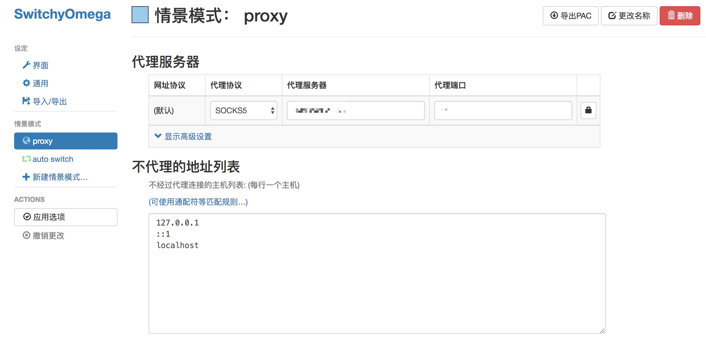
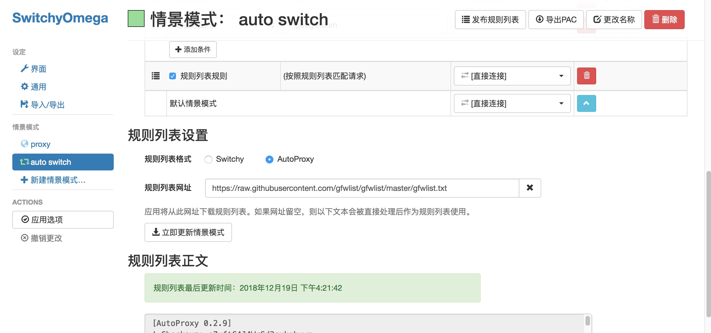
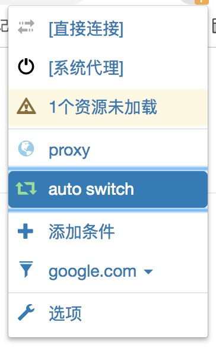
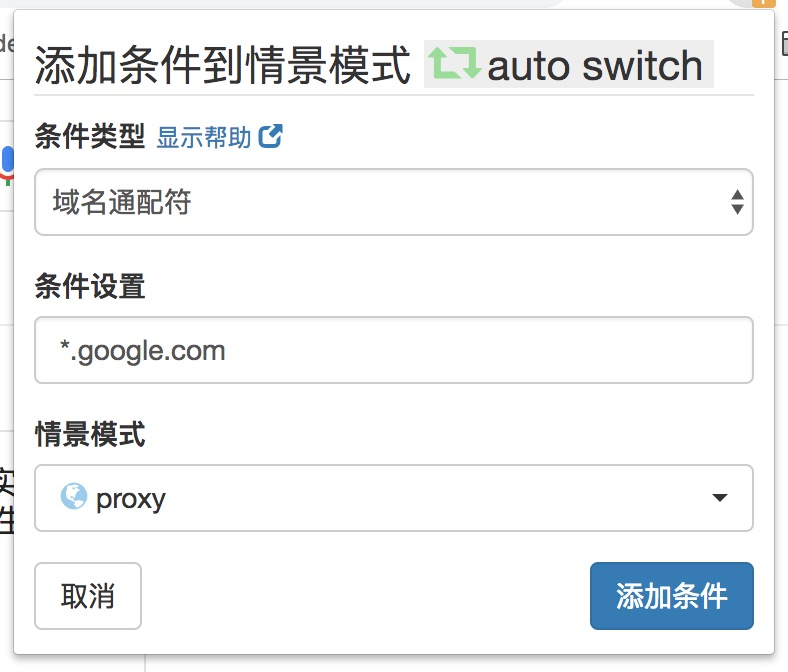

# 学习ssr爬墙与总结

## 前言

​	每次下载东西，都要呼叫我王哥，而我自己则傻傻地坐在电脑前等待王哥喂屎，不够香。我想，自己扒拉出来的应该更有味道，于是我更加稳当地坐在了小板凳上。

## 弱鸡扫盲

什么都不懂，什么都不知道，一个没见过世面的宁波养猪场二组技术员开始了搜狗百科。

### 什么是SOCKS

> 摘自： https://zh.wikipedia.org/wiki/SOCKS

SOCKS是一种网络传输协议，主要用于客户端与外网服务器之间通讯的中间传递。SOCKS是"SOCKetS"的缩写。

当防火墙后的客户端要访问外部的服务器时，就跟SOCKS代理服务器连接。这个代理服务器控制客户端访问外网的资格，允许的话，就将客户端的请求发往外部的服务器。

#### 与HTTP代理的对比

**SOCKS**：Bill希望通过互联网与Jane沟通，但他们的网络之间存在一个防火墙，Bill不能直接与Jane沟通。所以，Bill连接到他的网络上的SOCKS代理，告知它他想要与Jane创建连接；SOCKS代理打开一个能穿过防火墙的连接，并促进Bill和Jane之间的通信。

**HTTP**：Bill希望从Jane的Web服务器下载一个网页。Bill不能直接连接到Jane的服务器，因为在他的网络上设置了防火墙。为了与该服务器通信，Bill连接到其网络的HTTP代理。他的网页浏览器与代理通信的方式与他直接连接Jane的服务器的方式相同；也就是说，网页浏览器会发送一个标准的HTTP请求头。HTTP代理连接到Jane的服务器，然后将Jane的服务器返回的任何数据传回Bill。

#### GFW

中国国家防火墙，一旦发现数据包中有敏感信息，就会伪造RST数据包，分别发送给连接双方。

> 摘自：https://zh.wikipedia.org/wiki/%E9%98%B2%E7%81%AB%E9%95%BF%E5%9F%8E

**原理**：防火长城对所有经过骨干出口路由的在UDP的53端口上的域名查询进行IDS入侵检测，一经发现与黑名单关键词相匹配的域名查询请求，防火长城会马上伪装成目标域名的解析服务器给查询者返回虚假结果。由于通常的域名查询没有任何认证机制，而且域名查询通常基于的UDP协议是无连接不可靠的协议，查询者只能接受最先到达的格式正确结果，并丢弃之后的结果。用户若改用TCP在53端口上进行DNS查询，虽然不会被防火长城污染，但可能会遭遇连接重置，导致无法获得目标网站的IP地址。

ps: 看不懂原理是在搞什么飞机，先搬过来吧。

### 科学上网之Shadowsocks 

​	原来一直不明白它的原理，多亏了王哥的神作，在我看了几遍之后，才得以稍稍了解其原理。

> A fast tunnel proxy that helps you bypass firewalls.
>
> Features:
>
> - TCP & UDP support
> - User management API
> - TCP Fast Open
> - Workers and graceful restart
> - Destination IP blacklist

目前有 `libev`、`python`、`go`几个主要分支，之后的实践我只是使用了go。

**王哥**：浏览器要配置`socks5`代理(或者是配置系统`socks5`代理, 让浏览器走系统代理), 这时候浏览器发起`http`请求会被改写成`socks5`请求, 这个 `socks5` 客户端要先和 `shadowsocks local` 端进行握手, 客户端先发送握手包（具体想要了解的可以看上面的`socks`）。

其原理：

- 客户端服务器预共享密码
- 本地socks5 proxy server
- 软件/浏览器配置本地socks代理
- 本地socks server把数据包装，加密，发送到远程服务器
- 远程服务器解密，转发给对应的服务器

我又看了，给[非专业人士看的`Shadowsocks`简介](http://vc2tea.com/whats-shadowsocks/)，真香。

## 搭建（go版本）

> ​	shadowsocks-go is a lightweight tunnel proxy which can help you get through firewalls.
>
> ​      https://github.com/shadowsocks/shadowsocks-go

### 买VPS

古人云：运维不好，对象难找；英语不好，冲浪难搞。不无其中的道理：运维不好；又在买vultr时说好的送25刀，结果，也没送。。。


### 安装

#### go环境

```shell
yum install golang -y
```

#### 安装

```shell
# on server
go get github.com/shadowsocks/shadowsocks-go/cmd/shadowsocks-server
# on client
go get github.com/shadowsocks/shadowsocks-go/cmd/shadowsocks-local
```

在一台机器上安装了`ssserver`和`sslocal`，实现本地用户无需安装客户端且无需密码，在本地实现翻墙:

**app  ->  request vultr sslocal(encrypt)  ->  request vultr ssserver (decrypt) -> real host -> response to vultr ssserver(encrypt) ->  response to vultr sslocal(decrypt)  ->  app**

需插件`SwitchyOmega`，后续会说到。

#### 配置

Both the server and client program will look for `config.json` in the current directory. You can use `-c` option to specify another configuration file.

 Configuration file is in json ：

```shell
{
    "server":"server_name", 
    "server_port":8388, 
    "local_port":1080,
    "local_address":"127.0.0.1",
    "password":"barfoo!",
    "method": "aes-128-cfb",
    "timeout":600
}
```

| Name        | ExPLANATION                                                  |
| ----------- | ------------------------------------------------------------ |
| server      | your server ip or hostname                                   |
| server port | server port                                                  |
| local_port  | local socks5 proxy port                                      |
| method      | encryption method, null by default (table), the following methods are supported: aes-128-cfb, aes-192-cfb, aes-256-cfb, bf-cfb, cast5-cfb, des-cfb, rc4-md5, rc4-md5-6, chacha20, salsa20, rc4, table |
| password    | a password used to encrypt transfer                          |
| timeout     | server option, in seconds                                    |
| fast_open   | use [TCP_FASTOPEN](https://github.com/shadowsocks/shadowsocks/wiki/TCP-Fast-Open), true / false（echo 3 > /proc/sys/net/ipv4/tcp_fastopen 这个选项需要配合内核参数） |
| workers     | number of workers, available on Unix/Linux                   |
|             |                                                              |

我的配置:

```shell
# 进入安装好的目录
[root@vultr go]# ls
bin  src  sslocal.json  ssserver.json
[root@vultr go]# cat ssserver.json 
{
    "server":"vpsIP",
    "server_port":8388,
    "password":"password",
    "method": "aes-128-cfb",
    "timeout":300,
    "fast_open":false
}
[root@vultr go]# cat sslocal.json 
{
    "server":"vpsIP",
    "server_port":8388,
    "local_port":22,
    "local_address":"0.0.0.0",
    "password":"password",
    "method": "aes-128-cfb",
    "timeout":300,
    "fast_open":false
}
```

#### 运行

```shell
[root@vultr go]#  ./bin/shadowsocks-server -c ssserver.json
2018/12/19 06:44:19 server listening port 8388 ...

[root@vultr go]# ./bin/shadowsocks-local -c sslocal.json 
2018/12/19 06:45:51 available remote server 149.248.21.68:8388
2018/12/19 06:45:51 starting local socks5 server at 0.0.0.0:22 ...
```

后台运行

```shell
[root@vultr go]# nohup ./bin/shadowsocks-server -c ssserver.json &
[root@vultr go]# nohup ./bin/shadowsocks-local -c sslocal.json &

[root@vultr go]# ps -ef | grep shadowsocks-
root      5293  5189  0 06:49 pts/0    00:00:00 ./bin/shadowsocks-server -c ssserver.json
root      5299  5189  0 06:50 pts/0    00:00:00 ./bin/shadowsocks-local -c sslocal.json
root      5305  5189  0 06:51 pts/0    00:00:00 grep --color=auto shadowsocks-
```

搭建完毕，如果使用本地ssclient，记得打开对应端口即上述8388的防火墙：

```shell
firewall-cmd --add-port=8388/tcp --permanent

firewall-cmd --reload

firewall-cmd --list-ports

firewall-cmd --remove-port=8388/tcp --permanent
```

## 使用

本地客户端和chrome插件

### 本地客户端

> https://github.com/shadowsocks

客户端的在此不多说，记得开启防火墙。

### SwitchyOmega的使用

>https://github.com/FelisCatus/SwitchyOmega

首先在github上下载插件，或者直接在chrome web store下载[SwitchyOmega](https://chrome.google.com/webstore/detail/proxy-switchyomega/padekgcemlokbadohgkifijomclgjgif?hl=zh-CN)。

​	将下载好的插件添加到扩展程序中，SwitchyOmega支持多种模式：

* 直接连接：不使用任何代理；
* 系统代理：使用系统客户端模式代理；
* proxy：全部访问使用代理；
* autoswitch：根据访问自动判断是否需要代理。

#### 配置autoswitch模式

`autoswitch`模式使用非常方便，推荐使用，如果某些网站访问无法正确打开，可以写换到`proxy`模式。

1）打开chrome，点击右上角的SwitchyOmega插件图标，点击选项；

2）点击左侧的 `新建情景模式`，根据喜好输入情景模式名称 如：`Shadowsocks`，类型选择第一个`代理服务器`。创建完成后做如下配置：



​	可自行配置不代理的地址列表。

3）配置自动切换模式。点击左侧`auto switch`，规则列表选择`AutoProxy`，添加规则列表。



默认情景模式选择`直接连接`，这样就直接添加上了大多数网站的代理规则，如果遇到未添加的，可以自己再`添加条件`。





> 规则列表网址：https://raw.githubusercontent.com/gfwlist/gfwlist/master/gfwlist.txt
>
> gfwlist 是一个开源的黑名单项目，它由成千上万的网友贡献整理而成的一个包含了几乎所有被墙域名的列表，从而实现被墙的域名自动走代理。

## 优化

通过TCP BBR拥塞控制来进行加速的服务。

BBR 目的是要尽量跑满带宽, 并且尽量不要有排队的情况, 效果并不比速锐差。

​	使用root用户登录，运行以下命令：

```shell
wget --no-check-certificate https://github.com/teddysun/across/raw/master/bbr.sh && chmod +x bbr.sh && ./bbr.sh
```

​	安装完成后，脚本会提示需要重启 VPS，输入 y 并回车后重启。 重启

​	完成后，进入 VPS，验证一下是否成功安装最新内核并开启 TCP BBR，输入以下命令查看内核版本：

```shell
# 查看内核版本
uname -r
4.19.10-1.el7.elrepo.x86_64
```

```shell
# 执行
sysctl net.ipv4.tcp_available_congestion_control

# 返回值一般为：
net.ipv4.tcp_available_congestion_control = bbr cubic reno

# 或者为：
net.ipv4.tcp_available_congestion_control = reno cubic bbr
```

```shell
# 执行
sysctl net.ipv4.tcp_congestion_control

# 返回值一般为：
net.ipv4.tcp_congestion_control = bbr
```

```shell
# 执行
sysctl net.core.default_qdisc

# 返回值一般为：
net.core.default_qdisc = fq
```

执行 `lsmod | grep bbr`, 看到有 tcp_bbr 模块即说明 bbr 已启动。

注意：并不是所有的 VPS 都会有此返回值，若没有也属正常。


>一键安装最新内核并开启 BBR 脚本：https://teddysun.com/489.html
>
>来自Google的TCP BBR拥塞控制算法解析：https://blog.csdn.net/dog250/article/details/52830576
>
>开启TCP BBR拥塞控制算法：https://github.com/iMeiji/shadowsocks_install/wiki/%E5%BC%80%E5%90%AFTCP-BBR%E6%8B%A5%E5%A1%9E%E6%8E%A7%E5%88%B6%E7%AE%97%E6%B3%95

## 总结

​	倒腾了两天，蛮开心的，大神数不胜数，站在他们的肩膀上是一件多么令人兴奋的事情。非常感谢我王哥对我的zz问题一一解答。

​	总之，我王哥天下第一！

